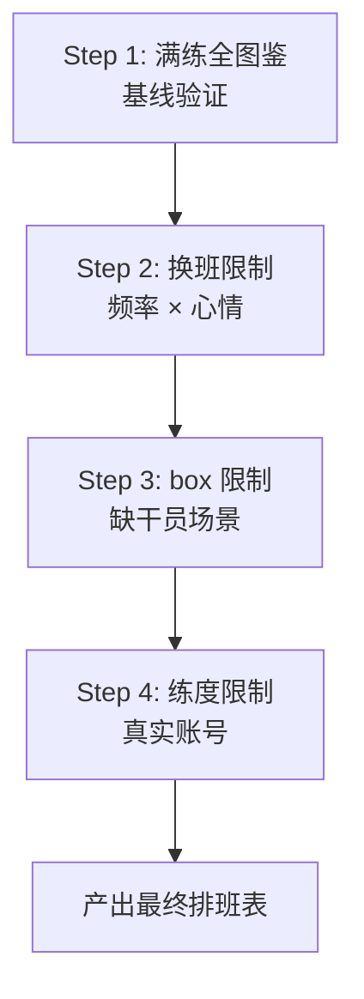

# 验证路线图

## 总体思路

四层验证金字塔——从理想条件向实际条件逐层叠加约束，每层只引入一个变量，精确定位偏离源头。

## Step 1: 满练全图鉴 — 基线验证

### 目标
在"所有干员精英2满级"假设下运行单班次贪心，验证算法核心逻辑的正确性。

### 输入
- 全干员 `building_data.json`，所有 `cond.phase` 视为已解锁（PHASE_2 全通过）
- layout: 243 (2 Trade + 4 Mfg + 3 Power)

### 预期输出
一组 `custom_infrast/*.json` 排班方案。

### 验证基准

**主要基准**: 公孙长乐 243-高配3队简化方案 (MAA 内置 `243_layout_3_times_a_day.json`)

| 对比维度 | 方法 |
|----------|------|
| 设施级匹配率 | 同一设施房间内，至少 2/3 干员与基准一致 |
| 效率总和偏差 | 同一设施内 efficient 总和与基准差距 ≤ 5% |
| 不匹配分析 | 记录所有不匹配的干员对，评估是否是联动组合导致的误差 |

**辅助基准**: 公孙长乐 243-极限效率一天四换方案 (`243_layout_4_times_a_day.json`)

### 通过标准
- 核心设施（Trade ×2, Mfg ×4）匹配率 ≥ 75%
- 没有明显的"应该排在前面却被跳过"的异常
- 不匹配项有合理解释（联动组合需要额外处理 / 纯贪心对联动不敏感）

### 产物
- 基准对比报告
- 决定"联动增强"是否值得做、做多深

---

## Step 2: 换班限制 — 频率 × 心情

### 目标
在 Step 1 数据基础上，限制换班频率，验证多班次切分与候选池管理逻辑。

### 测试矩阵

| 换班频率 | 班次数 | 每班候选需求 | 预期结果 |
|----------|--------|-------------|----------|
| 一天一换 | 1 | 29 人 | 最优解，无轮换压力 |
| 一天两换 | 2 | 58 人 | 每班次最优解，可能有少量冲突 |
| 一天三换 | 3 | 87 人 | 低分候选可能出现，部分房间需 autofill |

### 验证方式
- **一天一换**: 与 Step 1 结果完全一致（同基线）
- **一天两换**: 检查是否存在同一干员出现在两个班次的情况（违反 H2）
- **一天三换**: 统计 autofill 比例，确认候选池深度是否足够支撑 87 人的多次排布

### 通过标准
- 所有班次输出合法 JSON（符合 MAA 基建排班协议）
- 同一干员不跨班次重复
- 一天三换的 autofill 比例 ≤ 30%

---

## Step 3: box 限制 — 缺干员场景

### 目标
模拟不同收集程度的玩家，验证贪心算法在候选不足时的降级行为。

### 测试画像

| 画像 | 干员数 | 6★ 占比 | 代表场景 | 子集构造方法 |
|------|--------|---------|----------|-------------|
| 新手 | ~100 | ~10% | 刚推完主线 | 从全干员中按星级比例随机抽样 |
| 中练 | ~200 | ~25% | 有核心但体系不全 | 同上，提高 5/6★ 比例 |
| 准全 | ~350 | ~35% | 大部分联动组可凑 | 同上，接近全 box |

### 验证方式
每个画像 → 运行单班次贪心 → 统计：
- autofill 占比（候选不足 → MAA 自动补位的设施比例）
- 与全 box 结果的"关键干员损失率"（全 box 方案中排第一的干员有多少在受限 box 中不可用）

### 通过标准
- 新手画像: autofill ≤ 50%，输出至少包含控制中枢和主要生产设施
- 中练画像: autofill ≤ 20%
- 准全画像: autofill ≤ 5%，结果接近 Step 1

---

## Step 4: 练度限制 — 真实账号

### 目标
使用真实玩家数据 (`operators_data.json`)，验证精英化阶段对技能解锁的影响，产出最终可用的排班表。

### 输入
- 真实 `operators_data.json`（415 名干员，含 elite/level/potential）

### 验证方式
- 统计"因练度不足被过滤的技能数"（对照 Step 1，基准 205 个被锁）
- 对关键高价值干员检查技能是否被练度锁住（如精2才解锁的技能而干员只有精1）
- 输出的 JSON 在 MAA 中实际执行一次，确认无报错

### 通过标准
- JSON 通过 MAA 实际执行（mode=10000, Infrast 任务无报错）
- 所有设施的干员列表均为玩家实际拥有的干员
- 无精英化不足的干员被分配到需要高精英化技能的位置

### 产物
- 最终可用的 `custom_infrast/generated.json`
- 本次 session 的排班效率评估报告

---

## 里程碑

| 里程碑 | 验证步骤 | 交付物 |
|--------|---------|--------|
| M1 | Step 1 | 基准对比报告 + 联动决策 |
| M2 | Step 1 + 2 | 多班次合法 JSON + 换班矩阵 |
| M3 | Step 1 + 2 + 3 | box 降级报告 + 画像测试结果 |
| M4 | Step 1 + 2 + 3 + 4 | 最终排班表 + MAA 执行验证通过 |
