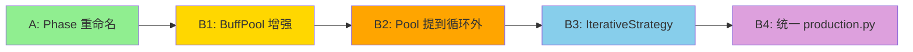

# BuffPool 不动点迭代 + Phase 命名规范化

> 版本: v0.1 | 日期: 2026-05-29 | 关联分支: 待定

## 一、背景与动机

### 1.1 当前痛点

求解器 Pipeline 按 `Mfg → Trade → Control → Remaining → Dorm` 顺序贪心推进。BuffPool（全局 buff 点数池）是一个跨设施耦合变量——中枢、宿舍、制造站、贸易站、办公室都向池中注入点数，制造站和贸易站又从池中消费点数换效率。但当前架构有两个结构性问题：

**问题 1：顺序贪心导致评分偏差。** Phase 1（Mfg）评估时 Trade 尚未确定，`compute_buff_pool()` 的 `has_ebnhlz_in_trade` / `has_wuyou_in_trade` 等参数只能靠估计。Phase 3（Trade）评估时 Mfg 已锁定，Trade 消费的池点数又被 Mfg 的决策压缩。信息单向流动导致评分不准确，可能错过"Trade 牺牲自身效率供给 Mfg 从而全局更优"的跨设施权衡。

**问题 2：Phase 文件命名误导。** 文件名中的阶段编号与实际执行顺序不匹配：

| 文件名 | 编号暗示 | Pipeline 实际顺序 |
|--------|:------:|:-----------------:|
| `phase1_mfg.py` | 第 1 步 | 第 1 步 |
| `phase2_control.py` | 第 2 步 | 第 3 步 |
| `phase3_trade.py` | 第 3 步 | 第 2 步 |
| `phase3_remaining.py` | 第 3 步 | 第 4 步 |
| `phase4_dorm.py` | 第 4 步 | 第 5 步 |

同时 `phase3_trade` 和 `phase3_remaining` 共用编号 3，易混淆。

### 1.2 解决方向

- **Track A**：Phase 文件重命名为动作语义（`exhaust_*` / `fill_*`），消除编号歧义
- **Track B**：BuffPool 提升为不动点迭代变量 → 各设施声明贡献 → 合并为全局 Pool → 统一评分 → 迭代至收敛

两个 Track 互相独立，可并行推进或顺序执行。

---

## 二、Track A：Phase 文件重命名

### 2.1 命名方案

| 当前文件 | → 新文件 | 新函数名 | 语义 |
|---------|---------|---------|------|
| `phase1_mfg.py` | `exhaust_mfg.py` | `exhaust_mfg` | 制造站 C(n,3) 穷举 |
| `phase2_control.py` | `fill_control.py` | `fill_control` | 中枢容量内填充 |
| `phase3_trade.py` | `exhaust_trade.py` | `exhaust_trade` | 贸易站 C(n,3) 穷举 |
| `phase3_remaining.py` | `fill_remaining.py` | `fill_remaining` | 剩余设施支配偏序填充 |
| `phase4_dorm.py` | `fill_dorm.py` | `fill_dorm` | 宿舍填充 |

**规律**：`exhaust_*` = 计算密集的穷举类，`fill_*` = 轻量的填充类。

### 2.2 改动范围

#### 2.2.1 源文件修改（8 个文件）

| 文件 | 改动 |
|------|------|
| `steward_core/solver/phase1_mfg.py` → `exhaust_mfg.py` | `_phase1_mfg` → `exhaust_mfg` |
| `steward_core/solver/phase2_control.py` → `fill_control.py` | `_phase2_control` → `fill_control` |
| `steward_core/solver/phase3_trade.py` → `exhaust_trade.py` | `_phase3_trade` → `exhaust_trade` |
| `steward_core/solver/phase3_remaining.py` → `fill_remaining.py` | `_phase3_remaining` → `fill_remaining` |
| `steward_core/solver/phase4_dorm.py` → `fill_dorm.py` | `_phase4_dorm` → `fill_dorm` |
| `steward_core/solver/pipeline.py` | 更新 5 个 import + 5 处 partial 引用 |
| `steward_core/solver/strategies/kbeam.py` | 更新 4 个 import + 6 处调用 |
| `steward_core/solver/context.py` | 更新 1 处注释中的文件名引用 |

**零行为变更**。Pipeline 的 `Phases` 列表不变，仅模块名和函数名变化。

### 2.3 测试

#### 2.3.1 受影响测试文件

| 文件 | 改动 |
|------|------|
| `tests/solver/test_pipeline.py` | 更新 `from steward_core.solver.phase1_mfg import _phase1_mfg` → 新路径 |
| `tests/solver/test_phase3_trade.py` | 文件重命名为 `test_exhaust_trade.py` |
| `tests/solver/test_phase1_mfg.py` | 文件重命名为 `test_exhaust_mfg.py` |
| `tests/solver/test_end_to_end.py` | 如有直接 import phase 模块需更新（当前未直接 import） |

#### 2.3.2 验收标准

1. `python -m pytest tests/ -v` 全部通过，用例数不减少
2. `git grep "phase[0-9]_" steward_core/solver/` 返回空（无残留旧命名）
3. `git grep "_phase[0-9]" steward_core/solver/` 返回空
4. `Pipeline.default().describe()` 输出不变（Phase ID 字符串不变，仅函数名变）
5. `BaselineStrategy` 执行结果与重命名前完全一致（回归对比）

---

## 三、Track B：BuffPool 不动点迭代

### 3.1 子任务 B1：BuffPool 可组合化

**目标**：`BuffPool` 支持 `__add__`（合并贡献）、`clone`（深拷贝）、`_derive`（派生字段）。

**文件**：`steward_core/synergy/buff_pool.py`

**改动**：在 `BuffPool` dataclass 上新增 3 个方法，将 `compute_buff_pool` 末尾的派生逻辑（烟火→巫术、感知→思维链环）抽为独立函数 `_derive_pool`。

```python
@dataclass
class BuffPool:
    yanhuo: int = 0
    perception: int = 0
    wushu_crystal: int = 0
    thought_chains: int = 0
    silent_resonance: int = 0
    engineering_robots: int = 0
    monster_cuisine: int = 0

    def __add__(self, other: "BuffPool") -> "BuffPool":
        return BuffPool(
            yanhuo=self.yanhuo + other.yanhuo,
            perception=self.perception + other.perception,
            wushu_crystal=self.wushu_crystal + other.wushu_crystal,
            thought_chains=self.thought_chains + other.thought_chains,
            silent_resonance=self.silent_resonance + other.silent_resonance,
            engineering_robots=self.engineering_robots + other.engineering_robots,
            monster_cuisine=self.monster_cuisine + other.monster_cuisine,
        )

    def clone(self) -> "BuffPool":
        return BuffPool(
            yanhuo=self.yanhuo, perception=self.perception,
            wushu_crystal=self.wushu_crystal, thought_chains=self.thought_chains,
            silent_resonance=self.silent_resonance, engineering_robots=self.engineering_robots,
            monster_cuisine=self.monster_cuisine,
        )

    # __eq__ 由 dataclass 自动生成（7 个基础类型字段），无需手写
```

`_derive_pool` 函数提取：

```python
def _derive_pool(pool: BuffPool) -> None:
    """原地更新派生字段：烟火→巫术结晶，感知→思维链环"""
    pool.wushu_crystal = pool.yanhuo // 5
    pool.thought_chains = pool.perception
```

`compute_buff_pool` 末尾从手动赋值改为调用 `_derive_pool(pool)`。确保增量合并后也能调用此函数更新派生字段。

**测试**：`tests/synergy/test_buff_pool.py` 新增 TestBuffPoolComposition 类

| 用例 | 验证点 |
|------|--------|
| `test_add_合并两个非零pool` | `BuffPool(yanhuo=10) + BuffPool(perception=5)` → `yanhuo=10, perception=5` |
| `test_add_多字段不互相干扰` | 7 个字段各设不同值，合并后各字段独立正确 |
| `test_clone_深拷贝` | `clone()` 后修改原对象不影响克隆体 |
| `test_eq_相同值相等` | 两个独立构造的同值 Pool 相等 |
| `test_eq_不同值不等` | `yanhuo` 差 1 即不等 |
| `test_derive_pool_烟火转巫术` | `yanhuo=14` → `wushu_crystal=2` |
| `test_derive_pool_感知转思维链环` | `perception=8` → `thought_chains=8` |

**验收**：`python -m pytest tests/synergy/test_buff_pool.py -v` 全部通过，现有 B1-B5 用例不退化。

---

### 3.2 子任务 B2：Pool 提到循环外

#### 3.2.1 Trade 循环（`exhaust_trade.py`）

**当前**（[phase3_trade.py:L85-L104](file:///d:/Dev/RhodeLogisticsSteward/steward_core/solver/phase3_trade.py#L85-L104)）：每个 combo 调用 `compute_buff_pool()`。

**改造后**：

```python
# 预计算不含 Trade 条件的 base pool
base_pool = compute_buff_pool(
    ctrl_ops, suich_count=params.suich_count,
    dorm_operators=dorm_est, dorm_level=params.dorm_level,
    layout=LayoutConfig.layout_243(),
)
# 注：compute_buff_pool 新增参数 has_wuyou_in_trade / has_ebnhlz_in_trade
# 默认为 False，仅含乌有/黑键的组合做 delta 修正

evaluated = []
for combo_ops in combos:
    has_wuyou = "乌有" in combo_names
    has_ebnhlz = "黑键" in combo_names

    if has_wuyou or has_ebnhlz:
        # 仅含特殊干员的组合重新计算（数量极少，通常 ≤ C(余数,2)）
        pool = compute_buff_pool(
            ctrl_ops, suich_count=params.suich_count,
            dorm_operators=dorm_est, dorm_level=params.dorm_level,
            has_ebnhlz_in_trade=has_ebnhlz,
            has_wuyou_in_trade=has_wuyou,
            layout=LayoutConfig.layout_243(),
        )
    else:
        pool = base_pool

    lmd = _evaluate_trade_combo(combo_ops, ..., pool, ...)
```

**预期收益**：≥90% 的组合直接使用 `base_pool`，消除 `C(n,3) - 少量` 次 `compute_buff_pool` 调用。

#### 3.2.2 Mfg 循环（`support.py` → `_evaluate_with_support`）

**当前**：每个 combo 调用 `GlobalContext.from_estimated()` → 内部调用 `compute_buff_pool()`。

**改造后**：将 `GlobalContext` 在循环外预构建一次。仅含迷迭香的组合需要重新计算 pool（`has_rosmontis_in_mfg` 影响感知信息生成）。同理 `ling_mood_below_12` 与迷迭香绑定，重新计算时可以一并处理。

**注意**：每个 combo 的 `support_map` 不同（中枢/宿舍/办公室的支撑干员不同），`GlobalContext` 的 `control_operators` 和 `dorm_operators` 随 combo 变化。但 BuffPool 中只有 `控制中枢源（令/重岳/夕）` 依赖 `control_operators`，其他源依赖的 `has_*` 标志是 combo 级别的。因此改造策略为：

1. 循环外：构建不含 combo 特定标志的 `base_pool`
2. 循环内：对变化部分（`control_operators` 不同 → 令/重岳/夕 贡献不同）做增量计算

如果 `control_operators` 变化频繁（每个 combo 的支撑不同），增量计算的优势会被稀释。此时应评估是否改为：**中枢固定估计**（用 locked_support 中的 Control 做 estimate，类似 Trade Phase 的做法）。这个决策在实施时根据 profiling 数据最终确定。

#### 测试

| 用例 | 验证点 |
|------|--------|
| Trade: base_pool 正确 | 给定固定 ctrl_ops + dorm_est，base_pool 值与逐个构造一致 |
| Trade: 含乌有修正 | 含乌有组合的 pool.yanhuo 比 base_pool 多 len(dorm_est) |
| Trade: 含黑键修正 | 含黑键组合的 pool.silent_resonance 比 base_pool 多 perception |
| Mfg: 含迷迭香修正 | 含迷迭香组合的 pool.perception 比 base_pool 多 len(dorm_est) |
| 回归：评分不变 | 改造前后 `evaluated` 列表（评分+组合名）完全一致 |

**验收**：`python -m pytest tests/solver/test_exhaust_trade.py tests/solver/test_exhaust_mfg.py -v` 全部通过。

---

### 3.3 子任务 B3：IterativeStrategy 实现

**文件**：`steward_core/solver/strategies/iterative.py`（新建）

#### 3.3.1 设计

```python
class IterativeStrategy(Strategy):
    """不动点迭代策略

    算法：
      1. 用当前估计逻辑生成乐观初始 Pool P₀
      2. 以 P_k 为全局基准评估所有 combo → 贪心分配
      3. 从分配结果反向构建 GlobalContext → 计算实际 Pool P_{k+1}
      4. 若 P_{k+1} == P_k → 收敛，返回结果；否则 k += 1 回到步骤 2
      5. 达到 max_rounds 仍不收敛 → 取最优轮次结果

    核心不变量：
      - 每一轮所有 combo 评估使用相同的 BuffPool —— 消除跨设施估计误差
      - 收敛条件 P_{k+1} == P_k 意味着 pool 与分配自洽
    """

    name = "iterative"

    def __init__(self, max_rounds: int = 5):
        self.max_rounds = max_rounds

    def execute(self, operators, config, op_lookup):
        params = config.params
        anchor_names = MFG_ANCHORS
        ctrl_global_names = set(get_system_contributors("Control", "global_bonus"))
        dorm_names_list = get_system_contributors("Dormitory")
        power_names = set(get_system_contributors("Power"))

        # Step 1: 乐观初始 Pool
        pool = self._initial_pool(operators, params, op_lookup)

        best_result = None
        best_score = -float("inf")

        for round_idx in range(self.max_rounds):
            # Step 2: 以 pool 为基准求解
            result = self._solve_with_pool(
                operators, config, op_lookup, pool,
                anchor_names, ctrl_global_names, dorm_names_list, power_names,
            )

            # Step 3: 从解反算实际 Pool
            new_pool = self._pool_from_result(result, operators, params)

            # Step 4: 收敛判断
            if new_pool == pool:
                return result  # 自洽解

            pool = new_pool

            # 追踪最优轮次
            score = _production_score(result.plans[0], operators, params)
            if score > best_score:
                best_score = score
                best_result = result

        # 达到上限未收敛 → 返回最优轮次
        return best_result if best_result else result
```

#### 3.3.2 关键私有方法

**`_initial_pool()`**：复用当前 `GlobalContext.from_estimated()` 逻辑——乐观假设乌有在 Trade、黑键在 Trade、迷迭香在 Mfg、令 mood<12（产出感知）。

```python
def _initial_pool(self, operators, params, op_lookup):
    dorm_est = [Operator(char_id="_dorm_0", name="填位宿舍0", skills=[])
                for _ in range(params.dorm_estimated_count)]
    ctx = GlobalContext.from_estimated(
        control_operators=[],  # 初始无中枢
        dorm_operators=dorm_est,
        all_operators=operators,
        assigned_names=set(),
        params=params,
        has_rosmontis_in_mfg=True,
        has_ebnhlz_in_trade=True,
        has_wuyou_in_trade=True,
        ling_mood_below_12=True,  # 乐观：令产出感知
        perception_from_office=params.office_perception_base,
    )
    return ctx.buff_pool
```

**`_solve_with_pool()`**：核心——将 Pool 注入到 Phase 评估中。

实现方式：在迭代求解时，用 SolverConfig 的参数覆盖 `params` 的 pool 相关默认值。Phase 函数通过 `config.params` 访问参数。可以新增 `SolverParams.fixed_buff_pool: BuffPool | None = None` 字段——非 None 时 `evaluate_room` 优先使用此 Pool 而非临时计算。

或者更简洁的做法——修改 `_evaluate_with_support` 和 `_evaluate_trade_combo`，增加可选参数 `override_pool: BuffPool | None = None`，调用方传入时直接使用。

推荐后者：改动集中、不影响现有调用方、未来淘汰 `fixed_buff_pool` 时无残留。

**`_pool_from_result()`**：调用现有的 `GlobalContext.from_plan(plan, operators, params).buff_pool`。

#### 3.3.3 SolverParams 新增字段

```python
# params.py
iterative_max_rounds: int = 5     # 最大迭代轮数
iterative_converge_tolerance: int = 0  # Pool 字段容差（0=严格相等）
```

#### 测试：`tests/solver/test_iterative.py`（新建）

| 层级 | 用例 | 验证点 |
|------|------|--------|
| 单元 | `test_初始pool_乐观假设` | 初始 Pool 的 yanhuo/perception > 0（乐观假设生效） |
| 单元 | `test_从空排班反算pool` | 空排班 → pool 全零 |
| 单元 | `test_pool_from_result_与from_plan一致` | `_pool_from_result` ↔ `GlobalContext.from_plan()` 输出一致 |
| 集成 | `test_纯效率池_一轮收敛` | 无 BuffPool 消费者的干员池 → 初始 Pool = 实际 Pool → 1 轮收敛 |
| 集成 | `test_有烟火消费者_多轮收敛` | 含黍+乌有 → 可能需要 2-3 轮收敛 |
| 集成 | `test_产出有效排班` | Plan 含 Mfg/Trade/Control/Power 等 |
| 集成 | `test_无重复干员` | H2 约束 |
| 集成 | `test_产物类型正确` | CR=CombatRecord, PG=PureGold |
| 集成 | `test_达到上限后返回最优` | max_rounds=1 时返回唯一一轮结果 |
| 回归 | `test_vs_baseline_不退化` | IterativeStrategy 产出 ≥ BaselineStrategy 产出 |

**最小收敛验证池**：构造一个含黍（Mfg 烟火消费者）+ 乌有（Trade 烟火生产者）的干员池，验证迭代后两者被同时选中（而不像顺序贪心可能遗漏）。

```python
def test_黍乌有协同_迭代收敛选中双方(self):
    """IterativeStrategy 能发现黍+乌有跨设施协同"""
    ops = _minimal_mfg_pool() + [
        make_op("黍", "shu", "Mfg", buff_id="buff_mfg_bd_n1_n1[004]"),
        make_op("乌有", "wuyou", "Trade", buff_id="buff_trade_bd_n1_n1[004]"),
    ]
    result = strategy_runner(IterativeStrategy, ops, max_rounds=5)
    assert_no_duplicate_operators(result)
    assert_operator_in_room(result, "Mfg", "黍")
    assert_operator_in_room(result, "Trade", "乌有")
```

#### 验收标准

1. `python -m pytest tests/solver/test_iterative.py -v` 全部通过
2. `IterativeStrategy` 在全量 TrueData 上不崩溃、不超时（<30s 壁钟时间）
3. `IterativeStrategy` 产出 ≥ `BaselineStrategy` 产出（`_production_score` 比较）
4. 至少一个用例验证了"迭代收敛发现了顺序贪心遗漏的协同"
5. `test_kbeam.py` 现有用例全部通过（不受影响）

---

### 3.4 子任务 B4：统一 production.py 与 context.py 重复代码

**文件**：`steward_core/production.py`、`steward_core/solver/context.py`

**问题**：`production.py:L487-L512` 中构建 BuffPool 的逻辑与 `GlobalContext.from_plan()` 几乎完全相同——检测迷迭香/黑键/乌有在哪个设施、计算 office_perception、调用 `compute_buff_pool`。

**改造**：`production.py` 的 `calculate()` 函数直接调用 `GlobalContext.from_plan(plan, operators, params)` 获取 `buff_pool`，删除重复的 ~25 行。

**测试**：`python -m pytest tests/test_production.py -v` 全部通过，输出值不变。

**验收**：回归测试通过，production.py 中不再直接调用 `compute_buff_pool`（减少一处调用点，降低维护成本）。

---

## 四、执行顺序与依赖



| 步骤 | 内容 | 预估行数 | 可独立提交 | 关键依赖 |
|:--:|------|:--:|:--:|------|
| **A** | Phase 文件重命名 | ~30 | ✅ | 无 |
| **B1** | BuffPool `__add__` / `clone` / `_derive_pool` | ~20 | ✅ | 无 |
| **B2** | Trade + Mfg 循环 Pool 提到外部 | ~40 | ✅ | B1 |
| **B3** | IterativeStrategy 实现 | ~80 | ✅ | B2 |
| **B4** | 统一 production.py + context.py | ~30 | ✅ | B1 |

**总计 ~200 行改动（含测试 ~350 行），5 个文件重命名，2 个测试文件重命名，1 个新策略文件，1 个新测试文件。**

A 和 B1 可并行开始（无冲突）。B2 依赖 B1（需要 `clone` 做增量修正）。B3 依赖 B2（需要循环外的 Pool 注入点）。B4 是独立清理。

---

## 五、改造后的目录结构

```
steward_core/solver/
├── __init__.py              # solve_mvp() 入口
├── config.py                # SolverConfig
├── params.py                # SolverParams (+ iterative_max_rounds)
├── strategy.py              # Strategy ABC + PartialSolution
├── pipeline.py              # Pipeline 组合
├── context.py               # GlobalContext
├── bundle.py                # SupportBundle / SupportResult
│
├── exhaust_mfg.py           # ← 制造站 C(n,3) 穷举
├── exhaust_trade.py         # ← 贸易站 C(n,3) 穷举
├── fill_control.py          # ← 中枢填充
├── fill_remaining.py        # ← 剩余设施填充
├── fill_dorm.py             # ← 宿舍填充
│
├── greed.py                 # 贪心分配/组合评估
├── support.py               # 支撑干员计算
├── refine.py                # 局部搜索后处理
├── global_state.py          # 包稀缺度评分
│
└── strategies/
    ├── __init__.py
    ├── baseline.py          # BaselineStrategy
    ├── kbeam.py             # KBeamStrategy
    └── iterative.py         # IterativeStrategy  ← 新增
```

---

## 六、风险与缓解

| 风险 | 概率 | 影响 | 缓解 |
|------|:--:|------|------|
| 不动点迭代不收敛 | 低 | 迭代浪费计算 → 退回 max_rounds=1（等价 Baseline） | `max_rounds` 可调，性能守卫 |
| 乐观初始 Pool 过高激活不该选的 combo | 中 | 迭代后收敛到"空欢喜"解 | 自洽校验（Pool == 实际 Pool）保证最终解一致 |
| Trade/Mfg 循环 Pool 提取引入回归 | 低 | 评分偏差 | 回归测试：改造前后 `evaluated` 列表完全一致 |
| Phase 重命名遗漏引用 | 低 | ImportError | `git grep` 检查 + CI 必过 |
| 迭代求解耗时显著增加 | 中 | 用户体验下降 | 典型收敛 ≤ 3 轮 → 耗时 ≤ 3× 当前；加 `max_rounds` 硬上限 |

---

## 七、检查清单

### Track A 完成标准

- [ ] 5 个 Phase 文件重命名完成
- [ ] 2 个测试文件重命名完成
- [ ] `pipeline.py` import 更新
- [ ] `kbeam.py` import 更新
- [ ] `context.py` 注释更新
- [ ] `git grep "phase[0-9]_" steward_core/` 返回空
- [ ] `python -m pytest tests/ -v` 全绿

### Track B 完成标准

- [ ] B1: `BuffPool.__add__` / `clone` / `_derive_pool` 实现 + 测试
- [ ] B2a: Trade 循环 Pool 提到外部 + 回归验证
- [ ] B2b: Mfg 循环 Pool 提到外部 + 回归验证
- [ ] B3: `IterativeStrategy` 实现 + 9 个测试用例通过
- [ ] B4: `production.py` 统一使用 `GlobalContext.from_plan()`
- [ ] 全量 TrueData 端到端：`IterativeStrategy` 不崩溃、产出 ≥ Baseline
- [ ] `python -m pytest tests/ -v` 全绿，无用例减少

---

## 八、实施笔记（2026-05-29）

### Step A 偏差
- kbeam.py 的 `_phase1_kbeam` 方法同步更名为 `_kbeam_exhaust_mfg`
- 5 个 Phase 模块的 docstring 去除了旧 Phase 编号，改为纯描述

### Step B1 偏差
- `_derive_pool` 作为内部函数不导出到 `__init__.py`，测试直接 import 自 `steward_core.synergy.buff_pool`
- `compute_buff_pool` 改用 `_derive_pool` 原地更新，语义完全等价

### Step B2 偏差
- Trade 循环：`base_pool` 变量名改为 `bp` 避免与函数级 `pool`（干员列表）冲突
- Mfg 循环：预计算的 `base_pool` 需传入 `layout=LayoutConfig.layout_243()`（初版遗漏导致审查 Bug）
- Mfg 循环：仅非迷迭香组合使用 `base_pool`，迷迭香组合走原有 `from_estimated` 路径（因其支撑干员变化影响池）
- `_evaluate_with_support` 新增 `override_pool` 参数——迭代模式下用外部注入池覆盖 `from_estimated` 的计算结果

### Step B3 偏差
- 绕过 Pipeline 直接调用 Phase（与 kbeam.py 一致），因为 Pipeline 不支持传递 `override_pool`
- `exhaust_mfg` 和 `exhaust_trade` 均新增 `override_pool` 参数——迭代模式下调用方传入统一池
- `IterativeStrategy` 导出到 `strategies/__init__.py`

### Step B4 偏差
- `production.py` 中通过局部 import `GlobalContext` + `SolverParams` 替代重复的 26 行代码
- 未移除顶层 import 的 `_B_ROSEMARY` 和 `_B_EBENHOLZ`（原用于此段代码，现无其他引用但保留不影响）

### 提交历史
```
63a5a7f refactor(production): 统一使用GlobalContext.from_plan替代重复的buff_pool构造
880511f feat(solver): 实现IterativeStrategy不动点迭代策略
c8a9004 refactor(solver): Trade和Mfg循环BuffPool提到外部预计算
d4842b5 feat(synergy): BuffPool 支持可组合化(__add__/clone/_derive_pool)
d639db7 refactor(solver): Phase文件重命名为动作语义(exhaust_*/fill_*)
```
