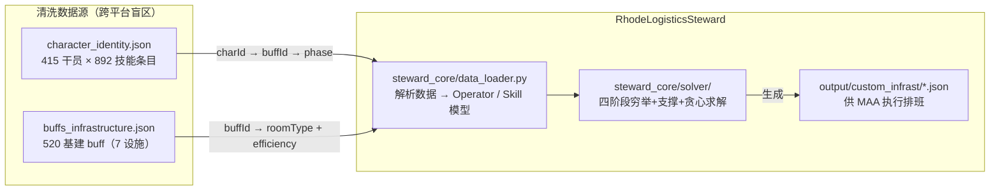
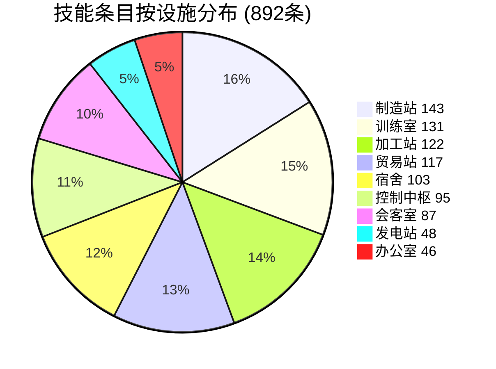
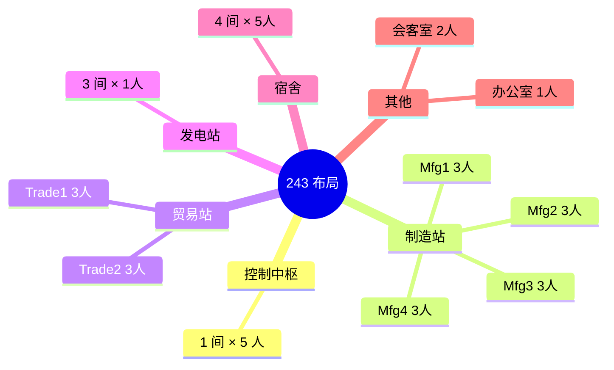

# 基建排班：约束体系与数据基线

> **版本**: 2026-05-31 · 基于 `character_identity.json` + `buffs_infrastructure.json` 交叉核验

## 1. 数据全景图

排班问题的完整数据链路：



### 1.1 数据文件说明

| 文件 | 内容 | 条目数 | 备注 |
|------|------|:---:|------|
| `character_identity.json` | 干员身份 + 技能列表 | 415 干员 / 892 技能 | 按 `charId` 索引，含 rarity/phase/roomType |
| `buffs_infrastructure.json` | 基建生产 buff 详情 | 520 buff | 按 `buffId` 索引，含 roomType/efficiency/description/charId |
| `buffs_non_production.json` | 训练室/加工站 buff | 207 buff | TRAINING=103 + WORKSHOP=104，排班求解不涉及 |

### 1.2 干员池概览（character_identity.json）

| 维度 | 数值 |
|------|------|
| 总干员 | **415** 名 |
| 6★ / 5★ / 4★ / 3★ / 2★ / 1★ | 131 / 191 / 61 / 17 / 5 / 10 |
| 总基建技能条目 | **892** 条（平均 2.15/人） |
| PHASE_0 / PHASE_1 / PHASE_2 | 451 / 87 / 354 |
| 生产相关设施技能 | 639 条（排除 TRAINING 131 + WORKSHOP 122） |



### 1.3 基建 Buff 池（buffs_infrastructure.json）

| 设施 | buff 数 | 直接效率 (e>0) | 条件/联动 (e=0) | 惩罚 (e<0) |
|------|:---:|:---:|:---:|:---:|
| MANUFACTURE | 109 | 51 | 55 | 3 |
| TRADING | 91 | 45 | 46 | 0 |
| CONTROL | 88 | 0 | 88 | 0 |
| DORMITORY | 83 | 0 | 83 | 0 |
| MEETING | 67 | 37 | 30 | 0 |
| HIRE | 43 | 39 | 4 | 0 |
| POWER | 39 | 29 | 10 | 0 |
| **合计** | **520** | **201** | **316** | **3** |

> CONTROL 和 DORMITORY 的 buff 效率值**全部为 0**——它们通过条件/联动机制间接影响全局（心情恢复、中枢减免等）。直接效率 buff 集中在 MANUFACTURE / TRADING / POWER / HIRE / MEETING 五类设施。MANUFACTURE 有 3 条负值 buff，对应干员基建技能的副作用（如心情消耗增加）。

**交叉核验**：`character_identity.json` 中引用的所有 `buffId` 与 `buffs_infrastructure.json` **100% 匹配**（520/520 个 buff 均被至少一名干员持有）。

### 1.4 设施容量（以 243 布局为例）

| 设施 | 房间数 | 每间人数 | 总工位 | 效率字段 |
|------|--------|----------|--------|----------|
| 控制中枢 Control | 1 | **5** | 5 | 心情恢复 |
| 贸易站 Trade | 2 | **3** | 6 | Money(龙门币)/SyntheticJade(源石碎片) |
| 制造站 Manufacture | 4 | **3** | 12 | CombatRecord/PureGold/OriginStone/Chip |
| 发电站 Power | 3 | **1** | 3 | Drone(无人机恢复) |
| 会客室 Reception | 1 | **2** | 2 | General/No1~No7(线索搜集) |
| 办公室 Office | 1 | **1** | 1 | HR(人脉联络) |
| 宿舍 Dormitory | 4 | 5 | 20 | 心情恢复(不参与效率) |

> 核心工位 = 29，干员/工位比 = **7.8:1**（415 干员中精1+可用 225 名）。  
> 约束复杂度不在"有没有人"，而在"选谁最好"——典型的**组合优化**问题。



### 1.5 会客室隐式线索搜集加成

会客室干员的线索搜集速度由两部分组成：**隐式基础加成**（与技能无关） + **显式技能加成**（线索搜集·α/β 等）。隐式加成来自游戏内置机制表（PRTS Wiki 会客室页面），每个进驻干员独立计算。

| 加成来源 | 条件 → 加成值 | 说明 |
|----------|--------------|------|
| 非涣散加成 | 始终 → **+5%** | 固定基础值 |
| 会客室等级 | Lv1→7% / Lv2→9% / Lv3→**11%** | 随设施等级提升 |
| 干员稀有度 | 1-3★→0% / 4★→2% / 5★→4% / 6★→**5%** | 高星干员拥有更高的基础贡献 |
| 干员精英阶段 | E0→0% / E1→8% / E2→**16%** | 精二干员大幅领先 |
| 宿舍氛围累计 | 0~→0% / 2000~→5% / 3000~→10% / 4000~→**15%** | 全宿舍氛围总和决定档位 |

> **默认假设**：精英阶段 = E2（满级），会客室 = Lv3，宿舍氛围 = 5000（>4000 档位）。  
> 典型 6★ 精二干员的隐式加成 = 5 + 11 + 5 + 16 + 15 = **+52%/人**，远超显式技能（如线索搜集·β +20%）。  
> 星级差异仅 3 个百分点（4★ vs 6★），对排序影响很小。  

---

## 2. 约束条件体系

排班问题中的约束分为三类：硬约束（不可违反）、软约束（需要优化）和联动约束（跨设施连锁）。

### 2.1 硬约束（Hard Constraints）

| # | 约束 | 说明 |
|---|------|------|
| H1 | 每设施人数上限 | Control≤5, Trade≤3/间, Mfg≤3/间, Power≤1/间, Reception≤2, Office≤1 |
| H2 | 每干员唯一占用 | 一个干员同时只能在**一个**设施的**一个**工位 |
| H3 | 技能解锁条件 | PHASE_0=451, PHASE_1=87, PHASE_2=354。精2 方可解锁 354 条技能 |
| H4 | 设施类型匹配 | 干员只能进驻其技能适用的设施（技能 `roomType` 决定） |
| H5 | 产物类型匹配 | 制造站的当前产物必须匹配干员技能（如做赤金时，仅赤金相关技能生效） |
| H6 | 跨周期可持续性 | Σ_w worked_hours(op, w) ≤ mood_full / mood_burn。排班周期结束后干员心情须不低于初始值，保证下一周期可正常启动。多班次排班的核心硬约束。即 §3.1 工作时长池。 |

### 2.2 软约束（Soft Constraints / 优化目标）

| # | 约束 | 说明 |
|---|------|------|
| S1 | 效率最大化 | 在合规前提下追求最高综合产出效率 |
| S2 | 心情平衡 | 控制同一设施干员的心情消耗节奏，避免集中耗尽。由 H6（跨周期可持续性）的形式化约束 + MoodContext 心情流转引擎共同保证 |
| S3 | 宿舍恢复 | 宿舍恢复是独立资源，通过 mood-driven 恢复估值（`mood_deficit × recovery_rate × eff_weight`，详见 `slot-processing-model.md` §8.5），不纳入 H6 的池容计算 |
| S4 | 会客室线索轮换 | 会客室只需凑齐线索，非效率优先场景可降低优先级 |

> **注意**：技能联动体系的详细分类见 [`synergy-systems.md`](./synergy-systems.md)。

---

## 3. 心情消耗与恢复模型

心情是排班问题的核心资源维度——每个干员拥有上限 24 点心情，工作时消耗、休息时恢复。心情耗尽（红脸 ≤ 0）时干员的基建技能和进驻效率全部失效（制造/贸易每人 -1%，发电/会客/办公室 -5%）。本模型将游戏机制转化为排班求解器的形式化约束。

> **实现对应**：[`MoodContext`](file:///d:/Dev/RhodeLogisticsSteward/steward_core/mood_flow.py#L195)（心情流转引擎）、[`SolverParams`](file:///d:/Dev/RhodeLogisticsSteward/steward_core/solver/params.py#L44)（心情参数集中管理）、[`evaluate_dorm_recovery()`](file:///d:/Dev/RhodeLogisticsSteward/steward_core/dorm_recovery.py#L9)（宿舍恢复聚合）。
> **心情联动技能**（BuffPool 生成/消费、中枢全局修正）见 [`synergy-systems.md`](./synergy-systems.md) §C2-§C3。

### 3.1 工作时长池

每个干员在班次内可连续工作的时间受心情限制：

\[
t_{\text{max}} = \frac{\text{mood\_initial}}{\text{mood\_burn}} \quad\text{（h）}
\]

其中 `mood_burn` 是该干员的净心情消耗率（§3.2），`mood_initial` 为初始心情值（下班后恢复的值，不一定是满值 24）。

多班次场景（H6）要求排班周期结束后的心情不低于初始值，即 Σ 消耗 ≤ Σ 恢复。这是跨周期可持续性的核心约束。

| 场景 | mood_burn | t_max（满心情出发） | 说明 |
|------|-----------|---------------------|------|
| 3级设施 + 5中枢（标准） | 0.65 | **36.9h** | 12h 班次内永不截断 |
| 3级设施 + 5中枢 + 玛恩纳扩散 | 0.30 | **80.0h** | 减免极强 |
| 3级设施 + 0中枢 | 0.90 | **26.7h** | 无中枢减免 |
| 1级设施 + 5中枢 | 0.75 | **32.0h** | 发电/会客/办公室适用 |

> **关键推论**：12h 班次下，t_max ≥ 12h 对绝大多数干员成立，因此当前求解器的 `constant_efficiency()` 不触发心情截断（`t_red ≥ T` 恒成立）。心情截断仅在多班次或极端配置（如斥罪 +0.5/h 自身消耗 + 5中枢减免 → burn = 1.0 - 0.25 + 0.5 = 1.25/h，t_max=19.2h，双班次 2×12=24h 时截断）下生效。

### 3.2 心情消耗率计算

#### 3.2.1 基础链

游戏内心情消耗采用"减数叠加"模型：

\[
\text{mood\_burn} = \max(0,\ 1.0 - X - Y)
\]

| 符号 | 含义 | 来源 | 值 |
|------|------|------|-----|
| `1.0` | 基础消耗率 | 游戏机制 | 1.0/h |
| `X` | 设施等级减免（白字） | 设施固有属性 | 3人工位=0.10，2人工位=0.05，1人工位=0 |
| `Y` | 干员技能 + 中枢减免（彩字） | 后勤技能 | 中枢满员=0.25 + 玛恩纳扩散=0.25 + 个体技能 |

**计算链路**（代码实现）：

```
base_burn = 1.0 - 0.05 × (room_slots - 1)     ← X 项（设施减免）
control_recovery = len(control_ops) × 0.05      ← 中枢基础减免
mlynar_spread → recovery += control_recovery + 0.10  ← 玛恩纳扩散
yanhuo / wisdel → recovery += max(yanhuo, wisdel)    ← 取最高（同类型不叠加）
mood_burn = max(0.0, base_burn - recovery)      ← 最终净消耗
```

**典型值**：

| 设施配置 | X | 中枢减免 | 玛恩纳扩散 | Y合计 | mood_burn |
|----------|---|----------|-----------|-------|-----------|
| Lv3 Mfg/Trade + 5中枢 | 0.10 | 0.25 | — | 0.25 | **0.65** |
| Lv3 Mfg/Trade + 5中枢 + 玛恩纳 | 0.10 | 0.25 | +0.35 | 0.60 | **0.30** |
| Lv2 Mfg/Trade + 5中枢 | 0.05 | 0.25 | — | 0.25 | **0.70** |
| Power/Office/Reception + 5中枢 | 0 | 0.25 | — | 0.25 | **0.75** |
| Power/Office/Reception + 5中枢 + 玛恩纳 | 0 | 0.25 | +0.35 | 0.60 | **0.40** |

> **注意**：中枢内部干员的消耗计算不同——他们天然享受 5 人减免（-0.25），不受设施减免。详见 [`MoodContext._control_burn()`](file:///d:/Dev/RhodeLogisticsSteward/steward_core/mood_flow.py#L382)。

#### 3.2.2 干员自身技能修正

部分干员技能会增减自身的心情消耗（作用于 X+Y 之上）：

| 类型 | 示例 | buff_id | 修正量 | 作用范围 |
|------|------|---------|--------|----------|
| 自身减免 | 泡泡 | `manu_cost_minus[000]` | **-0.25/h** | 仅自身 |
| 自身减免 | 火神 | `manu_cost_minus[001]` | **-0.25/h** | 仅自身 |
| 自身增加 | 斥罪 | `hire_spd&cost_P[000]` | **+0.5/h** | 仅自身 |
| 自身增加 | 阿罗玛 | `manu_spd&cost_P[000]` | **+0.25/h** | 仅自身 |
| 设施减免 | 黍 | `manu_cost[000]` | **-0.1/h** | 同房间全员 |
| 设施减免 | 火哨 | `trade_cost[000]` | **-0.1/h** | 同房间全员 |
| 设施增加 | 巫恋 | `trade_ord_spd&cost_P[000]` | **+0.25/h** | 同房间全员 |
| **消除** | 槐琥 | `manu_cost_all[000]` | **归零** | 同房间全员自身效果 |
| **消除** | 令 | `control_facCostReset[000]` | **归零** | 同中枢岁阵营干员 |

> **实现状态**：房间级 buff（黍/火哨/巫恋/槐琥/令）已通过 [`_MP_COST_ROOM_*` 表](file:///d:/Dev/RhodeLogisticsSteward/steward_core/mood_flow.py#L145) 接入 `work_burn()`。干员自身级 buff（泡泡/火神/斥罪等）当前未接入——mp_cost buff 数据存在于 `buffs_infrastructure.json` 中，尚未在 `work_burn()` 中扫描干员自身技能。

#### 3.2.3 消除类技能的精确语义

槐琥 `manu_cost_all[000]` 和令 `control_facCostReset[000]` 的"消除"仅作用于干员**自身技能**提供的心情消耗效果（无论正负），**不影响**以下来源的减免：
- 中枢提供的全局减免（-0.25）
- 玛恩纳扩散的减免
- 设施等级固有减免（X 项）
- 同房间干员施加的设施级 buff（如槐琥不消除黍的 `manu_cost[000]`）

举例：槐琥与阿罗玛（+0.25/h 自身）同房 → 阿罗玛的 +0.25 被消除；槐琥与火神（-0.25/h 自身）同房 → 火神的 -0.25 也被消除。

#### 3.2.4 心情为浮点数

游戏中干员心情实际为浮点数，UI 显示时向下取整。如显示"12"表示实际值 ∈ [12, 13)。这对心情门控技能有实际影响：令的技能要求心情 < 12（即显示 ≤ 11 时触发），而夕的技能在心情 > 12 时生效。

```python
# MoodContext 使用浮点比较
ctx.is_below("令", 12.0)  # 心情 < 12.0 时返回 True（对应游戏内显示 ≤ 11）
```

### 3.3 宿舍恢复速率

宿舍是心情恢复的唯一常规途径。恢复速率由三部分叠加：

\[
\text{recovery} = \text{基础} + \text{干员技能} + \text{中枢全局}
\]

#### 3.3.1 基础恢复（宿舍固有）

| 组成部分 | 公式 | 游戏内显示 | Lv5 5000氛围示例 |
|----------|------|-----------|-----------------|
| 等级基础 | `1.5 + 0.1 × dorm_level` | **白字** | 1.5 + 0.5 = **2.0** |
| 氛围加成 | `0.0004 × ambiance_per_room` | **绿字（氛围部分）** | 0.0004 × 5000 = **2.0** |
| **合计** | — | — | **4.0/h** |

> **实现**：[`evaluate_dorm_recovery()`](file:///d:/Dev/RhodeLogisticsSteward/steward_core/dorm_recovery.py#L47-L49) Rule 0。参数由 [`SolverParams`](file:///d:/Dev/RhodeLogisticsSteward/steward_core/solver/params.py#L35) `dorm_level`（默认 5）和 `dorm_ambiance_per_room`（默认 5000）控制。

#### 3.3.2 干员恢复技能分类

宿舍内干员的恢复技能按叠加规则分为四类：

| 类别 | buff_id 前缀 | 叠加规则 | 示例干员 |
|------|-------------|----------|----------|
| **自身恢复** | `dorm_rec_oneself*` / `dorm_rec_*&oneself*` | 取最大值（同干员多条技能） | 推进之王 +0.55/h |
| **单体恢复** | `dorm_rec_single*` | 同宿舍取最大值（多个提供者选最高） | 杜林 +0.25/h |
| **全体恢复** | `dorm_rec_all*` | 同宿舍多个提供者**累加** | 波登可 +0.15/h |
| **定向恢复** | `dorm_rec_tag*` / `dorm_rec_name*` 等 | 按目标条件分别判定，可叠加 | 摩根提升推进之王 +0.3/h |

> **实现**：[`evaluate_dorm_recovery()`](file:///d:/Dev/RhodeLogisticsSteward/steward_core/dorm_recovery.py#L52-L69) Rule 2-4。

#### 3.3.3 特殊恢复干员

| 干员 | 机制 | 恢复量 | 建模 |
|------|------|--------|------|
| **菲亚梅塔** | 自律恢复，隔离所有外部加成 | **固定 2.0/h** | Rule 1，命中 `dorm_recExcludeOther` 直接返回 2.0 |
| **菲亚梅塔（交换）** | 满心情时与前一位入住干员互换心情 | N/A | 当前未建模（求解器留有 `fiammetta_swap_planned` 占位） |
| **冰酿** | 0.8 总池按宿舍人数均分 | 1人→0.8/h，2人→0.4/h，4人→0.2/h | 当前未建模（需要均分池类型而非固定 max/sum） |

#### 3.3.4 中枢→宿舍全局加成

控制中枢部分干员可为宿舍提供额外恢复：

| 来源 | 条件 | 加成 |
|------|------|------|
| 凯尔希 / 歌蕾蒂娅 / 铃兰 | 中枢进驻 | +0.15~0.2/h（全员） |
| 阿斯卡纶 | 中枢进驻 | +0.45/h（仅 5★+ 干员） |
| 人间烟火联动 | 重岳中枢 + 烟火点数 | +0.05 × (烟火 / 20) |

> **实现**：[`MoodModifiers`](file:///d:/Dev/RhodeLogisticsSteward/steward_core/mood_flow.py#L33) `dorm_bonus_all` / `dorm_bonus_elite` / `yanhuo_recovery`。

### 3.4 红脸截断与效率模型

心情降至 ≤ 0 时，干员的基建技能和进驻效率全部失效。在效率函数中表现为分段截断：

\[
e(t) = \begin{cases}
e_{\text{skill}}(t) & \text{if } t < t_{\text{red}} \\
0 & \text{if } t \geq t_{\text{red}}
\end{cases}
\quad\text{where } t_{\text{red}} = \frac{\text{mood\_initial}}{\text{mood\_burn}}
\]

> **实现**：[`constant_efficiency()`](file:///d:/Dev/RhodeLogisticsSteward/steward_core/efficiency_fn.py#L27) 和 [`ramping_efficiency()`](file:///d:/Dev/RhodeLogisticsSteward/steward_core/efficiency_fn.py#L55) 均已支持 `mood_burn` 参数截断。详见 [`efficiency-function-design.md`](./efficiency-function-design.md) §4.1。

部分干员的技能效率与心情值挂钩（如令、夕），此类心情门控由 `MoodContext.is_below()` 和 [`stepped_efficiency()`](file:///d:/Dev/RhodeLogisticsSteward/steward_core/efficiency_fn.py#L213)（铅踝梯级衰减）处理，不属于红脸截断范畴。

### 3.5 工休比与班次时间分配

#### 3.5.1 理论推导

设干员工作时心情消耗率为 `x`（消耗/h），宿舍休息时恢复率为 `y`（恢复/h），一管心情为 24 点：

\[
\begin{aligned}
t_{\text{work,max}} &= \frac{24}{x} \quad\text{（最长连续工作时间）} \\
t_{\text{rest}} &= \frac{24}{y} \quad\text{（从零回满所需时间）} \\
\text{最大工休比} &= \frac{y}{x} \\
\text{最大工作时长占比} &= \frac{y}{x + y} \\
\text{24h 内最长工作时间} &= \frac{24y}{x + y}
\end{aligned}
\]

#### 3.5.2 典型配置

| 布局 | 宿舍等级 | 设施等级 | x | y（基础+宿管） | 工作占比 | 24h最长工作 | 常见换班 |
|------|----------|----------|---|---------------|----------|------------|----------|
| 243 | Lv5 (4.0/h) | Lv3 (0.65) | 0.65 | 4.0~4.5 | 86~87% | 20.6h | **20/4** |
| 252 | Lv1 (1.6/h) | Lv3 (0.65) | 0.65 | 1.6~2.2 | 71~77% | 17~18.5h | **16/8** 或 **18/6** |
| 342 | Lv1 (1.6/h) | Lv3 (0.65) | 0.65 | 1.6~2.2 | 71~77% | 17~18.5h | **16/8** |

> 工作占比由组合内消耗最快的干员决定。常见瓶颈：承曦格雷伊（自动化组合）、絮雨（感知组）、斥罪（办公室 +0.5/h）。建议将这些干员分配至恢复速率最高的宿舍。

#### 3.5.3 多班次调度约束

多班次排班的核心约束链条：

```
班次安排 → 心情消耗 → 宿舍恢复 → 下一班次初始心情 → 可工作时间
```

当宿舍容量有限（243 下 29 人上班但只有 20 个宿舍位）时，不可能所有人同时休息。常见策略：

1. **错峰轮换**：主力分批次休息（如 A 组 20h 工作 / B 组 4h 替班），确保宿舍内总有空间
2. **菲亚梅塔代睡**：利用菲亚梅塔的 2.0/h 自律恢复支持 3 人 007 永续（2.0 - 0.65×3 = 0.05 盈余）
3. **低消耗干员优先**：泡泡/火神等负消耗干员可连续工作更久，降低轮换频率

> **实现**：`MoodContext.after_shift()` 提供不可变的心情流转模拟。恢复通过干员在宿舍在位期间自然发生（无班间间隔概念）。

---

## 附录 A: 数据溯源 — 全部断言核验记录

本附录逐条列出文档中所有数据断言的来源与交叉核验结果，构成项目的**可信数据基线**。

> 核验脚本（概念引用）：以下验证方式中提到的 `verify_coverage.py` / `verify_baseline.py` 为项目早期的独立验证脚本。

### A.1 干员池数据（§1.2）

| 断言 | 来源 | 核验 |
|------|------|------|
| 总干员 415 名 | `character_identity.json` → 顶层 key 计数 | `len(character_identity) = 415` ✅ |
| 6★=131 / 5★=191 / 4★=61 / 3★=17 / 2★=5 / 1★=10 | `character_identity.json` → `rarity` 字段 | rarity 5→6★(131), 4→5★(191), 3→4★(61), 2→3★(17), 1→2★(5), 0→1★(10) ✅ |
| 基建技能 892 条 | `character_identity.json` → 展开所有 `skills[]` 数组 | 实际 sum(len(c['skills']) for c in ci) = 892 ✅ |
| PHASE_0=451, PHASE_1=87, PHASE_2=354 | `character_identity.json` → `skills[].phase` | 逐条统计一致 ✅ |
| 技能-设施分布（饼图数据） | `character_identity.json` → `skills[].roomType` | 与旧版 `building_data.json` 统计完全一致 ✅ |

### A.2 基建 Buff 数据（§1.3）

| 断言 | 来源 | 核验 |
|------|------|------|
| `buffs_infrastructure.json` 含 520 条 buff | 文件 `len()` | `len(buffs_infrastructure) = 520` ✅ |
| 按设施分布: Mfg=109, Trade=91, Control=88, Dorm=83, Meeting=67, Hire=43, Power=39 | `buffs_infrastructure.json` → `roomType` 分组计数 | 逐设施计数一致 ✅ |
| efficiency=0 的 buff 316 条, >0 的 201 条, <0 的 3 条 | `buffs_infrastructure.json` → `efficiency` 字段 | 316 + 201 + 3 = 520 ✅ |
| 520 个 buff **全部**被 character_identity 中干员持有 | 交叉比对 `buffId` | `set(bi.keys()) ⊆ set(all_buff_ids_in_ci)` → 520/520 ✅ |
| CONTROL 设施的 88 个 buff 效率值全部为 0 | `buffs_infrastructure.json` → `roomType=CONTROL` 所有 entry | 88 条 `efficiency=0`，无例外 ✅ |

### A.3 设施容量（§1.4）

| 断言 | 来源 | 核验 |
|------|------|------|
| Control≤5, Trade≤3, Mfg≤3, Power≤1, Reception≤2, Office≤1 | 游戏机制 + MAA `custom_infrast` 协议 | 游戏内基建界面 + MAA 文档确认 |
| 243布局: 2Trade + 4Mfg + 3Power | 社区效率论共识 + MAA 内置模板 | MAA `resource/custom_infrast/243_layout_*.json` |
| 核心工位 = 29 | 5+2×3+4×3+3×1+2+1 | 算术验证 ✅ |

### A.4 硬约束 H3: 技能解锁条件（§2.1）

| 断言 | 来源 | 核验 |
|------|------|------|
| PHASE_0=451, PHASE_1=87, PHASE_2=354 | `character_identity.json` → `skills[].phase` | 等同 §A.1 ✅ |
| 精2 方可解锁 354 条技能 | phase=2 的 buff 要求干员 elite≥2 | 与 `buffs_infrastructure.json` 交叉：这些 buff 的 charId 对应的干员 rarity≥4 方有 elite=2 能力 |

### A.5 心情消耗与恢复数据（§3）

| 断言 | 来源 | 核验 |
|------|------|------|
| 基础消耗率 1.0/h | PRTS Wiki + 游戏内显示 | 单人进驻任意设施，1h 消耗 1 点心情 |
| 中枢满员减免 -0.25/h（5×0.05） | PRTS Wiki [控制中枢](https://prts.wiki/w/%E7%BD%97%E5%BE%B7%E5%B2%9B%E5%9F%BA%E5%BB%BA/%E6%8E%A7%E5%88%B6%E4%B8%AD%E6%9E%A2) | 游戏内心情栏 X 值 = 5×0.05 |
| Lv3 设施减免 -0.10/h | PRTS Wiki + 游戏内 UI（白字 X） | 3人工位设施进驻 3 人时显示 -0.10 |
| 宿舍基础恢复: 1.5 + 0.1×等级 + 0.0004×氛围 | PRTS Wiki [宿舍](https://prts.wiki/w/%E7%BD%97%E5%BE%B7%E5%B2%9B%E5%9F%BA%E5%BB%BA/%E5%AE%BF%E8%88%8D) §心情恢复 | 白字=1.5+0.1×等级, 绿字=0.0004×氛围+技能加成 |
| 满级宿舍基础恢复 = 4.0/h | 公式代入 Lv5+5000氛围 | 1.5+0.5+2.0=4.0 |
| 菲亚梅塔自律固定 2.0/h | `buffs_infrastructure.json` → `dorm_recExcludeOther[000]` | efficient 字段 max_value=0，游戏机制为固定值 |
| 单体恢复取 max / 全体恢复累加 | PRTS Wiki [进驻机制](https://prts.wiki/w/%E7%BD%97%E5%BE%B7%E5%B2%9B%E5%9F%BA%E5%BB%BA#%E8%BF%9B%E9%A9%BB%E6%9C%BA%E5%88%B6) | 同种效果取最高、不同种可叠加 |
| 冰酿 0.8 总池按人数均分 | PRTS Wiki + 游戏实测 | 1人→0.8, 2人→0.4, 4人→0.2 |
| 心情为浮点数，UI 向下取整 | PRTS Wiki [游戏数据基础](https://prts.wiki/w/%E6%B8%B8%E6%88%8F%E6%95%B0%E6%8D%AE%E5%9F%BA%E7%A1%80) | 令显示 12 时实际 ∈ [12,13)，不触发技能 |
| 槐琥消除仅作用自身技能效果 | PRTS Wiki + 游戏实测（黄字部分） | 不消除中枢/设施减免/同房设施级 buff |
| 玛恩纳 + 维什戴尔 + 重岳 同类型取最高 | PRTS Wiki [控制中枢技能](https://prts.wiki/w/%E7%BD%97%E5%BE%B7%E5%B2%9B%E5%9F%BA%E5%BB%BA/%E6%8E%A7%E5%88%B6%E4%B8%AD%E6%9E%A2) | 三者全局消耗减免不叠加 |

### A.6 关键外部数据源

| 资源 | URL | 用途 |
|------|-----|------|
| **ArknightsGameData** | [GitHub](https://github.com/Kengxxiao/ArknightsGameData) | character_table.json + building_data.json（原始数据） |
| **MAA** | [GitHub Releases](https://github.com/MaaAssistantArknights/MaaAssistantArknights/releases) | infrast.json + custom_infrast/ 模板（效率值 + 参考方案） |
| **PRTS Wiki** | [prts.wiki](https://prts.wiki/) | 基建机制（心情/消耗/恢复速率） |
| **一图流排班生成器** | [ark.yituliu.cn/tools/schedule](https://ark.yituliu.cn/tools/schedule) | 可视化排班方案参考 |
| **MAA 基建排班协议** | [docs.maa.plus](https://docs.maa.plus/zh-cn/protocol/base-scheduling-schema.html) | custom_infrast JSON schema |

### A.7 MAA 内置参考模板

| 文件 | 布局 | 换班频率 |
|------|------|----------|
| `243_layout_3_times_a_day.json` | 2贸易/4制造/3电站 | 8H 一换 |
| `243_layout_4_times_a_day.json` | 2贸易/4制造/3电站 | 6H 一换 |
| `153_layout_3_times_a_day.json` | 1贸易/5制造/3电站 | 8H 一换 |
| `153_layout_4_times_a_day.json` | 1贸易/5制造/3电站 | 6H 一换 |
| `333_layout_for_Orundum_3_times_a_day.json` | 3贸易/3制造/3电站（搓玉） | 8H 一换 |

---

## 参考

- 策略概要（编码上下文）: [slot-processing-model.md](./slot-processing-model.md)
- 效率函数统一建模: [efficiency-function-design.md](./efficiency-function-design.md)
