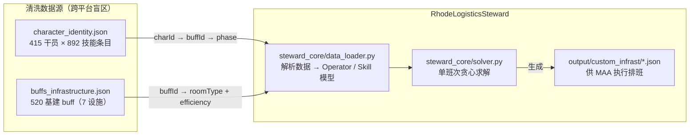
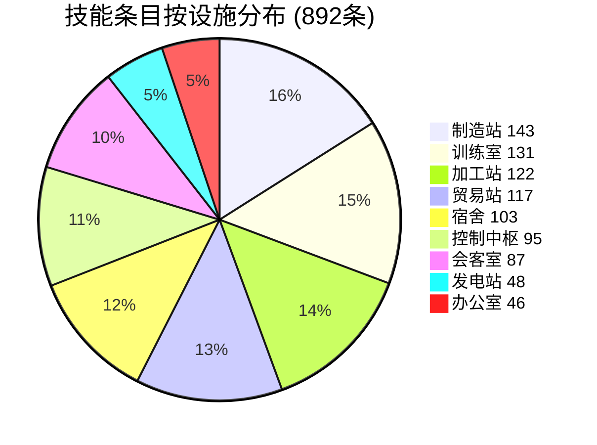
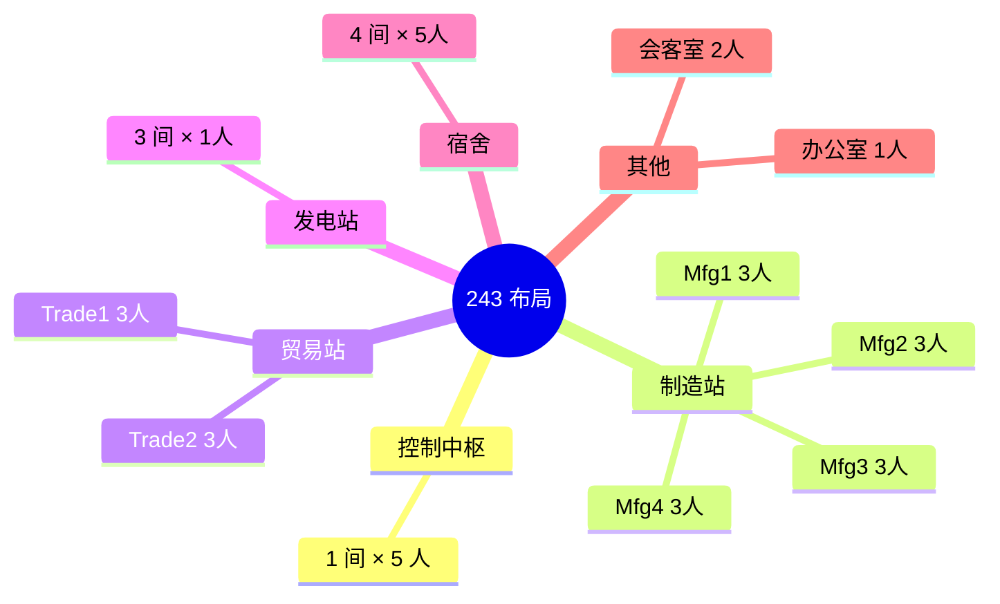
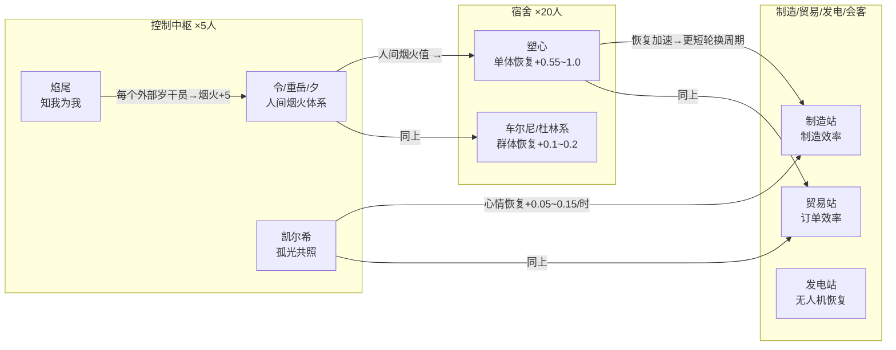
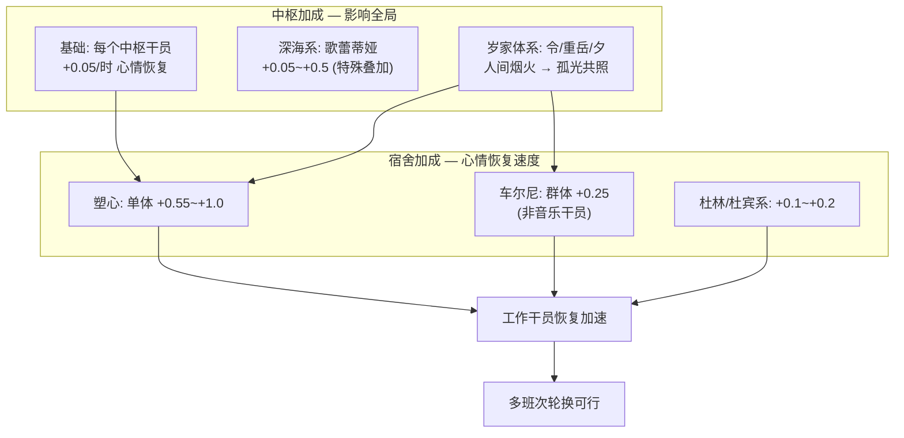

# 基建排班：约束体系与数据基线

> **版本**: 2026-05-26 · 基于 `character_identity.json` + `buffs_infrastructure.json` 交叉核验

## 1. 数据全景图

排班问题的完整数据链路：

### 1.1 数据文件说明

| 文件 | 内容 | 条目数 | 备注 |
|------|------|:---:|------|
| `character_identity.json` | 干员身份 + 技能列表 | 415 干员 / 892 技能 | 按 `charId` 索引，含 rarity/phase/roomType |
| `buffs_infrastructure.json` | 基建生产 buff 详情 | 520 buff | 按 `buffId` 索引，含 roomType/efficiency/description/charId |
| `buffs_non_production.json` | 训练室/加工站 buff | 207 buff | TRAINING=103 + WORKSHOP=104，排班求解不涉及 |

### 1.2 干员池概览（character_identity.json）

| 维度 | 数值 |
|------|------|
| 总干员 | **415** 名 |
| 6★ / 5★ / 4★ / 3★ / 2★ / 1★ | 131 / 191 / 61 / 17 / 5 / 10 |
| 总基建技能条目 | **892** 条（平均 2.15/人） |
| PHASE_0 / PHASE_1 / PHASE_2 | 451 / 87 / 354 |
| 生产相关设施技能 | 639 条（排除 TRAINING 131 + WORKSHOP 122） |

### 1.3 基建 Buff 池（buffs_infrastructure.json）

| 设施 | buff 数 | 直接效率 (e>0) | 条件/联动 (e=0) | 惩罚 (e<0) |
|------|:---:|:---:|:---:|:---:|
| MANUFACTURE | 109 | 51 | 55 | 3 |
| TRADING | 91 | 45 | 46 | 0 |
| CONTROL | 88 | 0 | 88 | 0 |
| DORMITORY | 83 | 0 | 83 | 0 |
| MEETING | 67 | 37 | 30 | 0 |
| HIRE | 43 | 39 | 4 | 0 |
| POWER | 39 | 29 | 10 | 0 |
| **合计** | **520** | **201** | **316** | **3** |

> CONTROL 和 DORMITORY 的 buff 效率值**全部为 0**——它们通过条件/联动机制间接影响全局（心情恢复、中枢减免等）。直接效率 buff 集中在 MANUFACTURE / TRADING / POWER / HIRE / MEETING 五类设施。MANUFACTURE 有 3 条负值 buff，对应干员基建技能的副作用（如心情消耗增加）。

**交叉核验**：`character_identity.json` 中引用的所有 `buffId` 与 `buffs_infrastructure.json` **100% 匹配**（520/520 个 buff 均被至少一名干员持有）。

### 1.4 设施容量（以 243 布局为例）

| 设施 | 房间数 | 每间人数 | 总工位 | 效率字段 |
|------|--------|----------|--------|----------|
| 控制中枢 Control | 1 | **5** | 5 | 心情恢复 |
| 贸易站 Trade | 2 | **3** | 6 | Money(龙门币)/SyntheticJade(源石碎片) |
| 制造站 Manufacture | 4 | **3** | 12 | CombatRecord/PureGold/OriginStone/Chip |
| 发电站 Power | 3 | **1** | 3 | Drone(无人机恢复) |
| 会客室 Reception | 1 | **2** | 2 | General/No1~No7(线索搜集) |
| 办公室 Office | 1 | **1** | 1 | HR(人脉联络) |
| 宿舍 Dormitory | 4 | 5 | 20 | 心情恢复(不参与效率) |

> 核心工位 = 29，干员/工位比 = **7.8:1**（415 干员中精1+可用 225 名）。  
> 约束复杂度不在"有没有人"，而在"选谁最好"——典型的**组合优化**问题。

---

## 2. 约束条件体系

排班问题中的约束分为三类：硬约束（不可违反）、软约束（需要优化）和联动约束（跨设施连锁）。

### 2.1 硬约束（Hard Constraints）

| # | 约束 | 说明 |
|---|------|------|
| H1 | 每设施人数上限 | Control≤5, Trade≤3/间, Mfg≤3/间, Power≤1/间, Reception≤2, Office≤1 |
| H2 | 每干员唯一占用 | 一个干员同时只能在**一个**设施的**一个**工位 |
| H3 | 技能解锁条件 | PHASE_0=451, PHASE_1=87, PHASE_2=354。精2 方可解锁 354 条技能 |
| H4 | 设施类型匹配 | 干员只能进驻其技能适用的设施（技能 `roomType` 决定） |
| H5 | 产物类型匹配 | 制造站的当前产物必须匹配干员技能（如做赤金时，仅赤金相关技能生效） |

### 2.2 软约束（Soft Constraints / 优化目标）

| # | 约束 | 说明 |
|---|------|------|
| S1 | 效率最大化 | 在合规前提下追求最高综合产出效率 |
| S2 | 心情平衡 | 避免同一设施干员同时心情耗尽导致产能断档 |
| S3 | 宿舍恢复 | 宿舍内干员需提供足够的心情恢复速率以支撑轮换 |
| S4 | 会客室线索轮换 | 会客室只需凑齐线索，非效率优先场景可降低优先级 |

### 2.3 联动约束（Combinatorial / Cross-facility）

这是排班问题**最复杂的部分**——技能描述中大量"如果 X 在 Y 则 +Z%"类型的条件。

#### 2.3.1 同设施联动（Local Combo）

同一设施内干员之间存在直接联动：

| 联动类型 | 示例 | 涉及技能数 |
|----------|------|-----------|
| **干员配对** | 巫恋+龙舌兰+卡夫卡 → 贸易站效率组合 | Trade: 9个配对 |
| **阵营联动** | 格拉斯哥帮干员同贸易站 → 推王额外+35% | Trade: ~10个阵营 |
| **同类加成** | 每个"标准化"技能为多萝西+5% | Mfg: ~5个互动系 |
| **相邻影响** | 拉普兰德+德克萨斯 → 订单上限+4 | Trade 特定 |

#### 2.3.2 跨设施联动（Cross-facility Cascade）

干员在不同设施之间的互动形成**连锁效应**：

> 核心链: **中枢体系 → 宿舍恢复速率 → 全设施轮换速度**，多班次运转的关键。

#### 2.3.3 宿舍与中枢的恢复链

这是维持多班次运转的核心机制：

---

## 3. 基础设施技能分类学

### 3.1 排班相关设施

| 设施 | 技能条目 | buff 数 | 排班角色 |
|------|:---:|:---:|------|
| 制造站 MANUFACTURE | 143 | 109 | 核心产出 |
| 贸易站 TRADING | 117 | 91 | 核心产出 |
| 控制中枢 CONTROL | 95 | 88 | 全局调节 |
| 宿舍 DORMITORY | 103 | 83 | 轮换支撑 |
| 会客室 MEETING | 87 | 67 | 线索收集 |
| 发电站 POWER | 48 | 39 | 无人机产出 |
| 办公室 HIRE | 46 | 43 | 人脉联络 |

> 训练室 TRAINING（131 条目）和加工站 WORKSHOP（122 条目）属于非生产设施，buff 详情见 `buffs_non_production.json`（TRAINING=103 + WORKSHOP=104 = 207 条），排班求解时不涉及。

### 3.2 制造站技能谱系

| 类型 | 特征 | 代表性 buffId 形态 |
|------|------|----------|
| **通用高加成** | `all=30+` | `manu_prod_spd[xxx]` efficiency≥30 |
| **赤金特化** | `PureGold=25+` | `manu_gold_spd[xxx]` |
| **作战记录特化** | `CombatRecord=30+` | `manu_rec_spd[xxx]` |
| **源石碎片** | `OriginStone=30+` | `manu_stone_spd[xxx]` |
| **仓库容量联动** | 每格仓库+1~3% | 条件 buff（efficiency=0，通过 description 描述联动） |
| **阵营Buff** | 同设施内阵营联动 | 条件 buff（A1/莱茵科技/标准化等阵营） |

### 3.3 贸易站技能谱系

| 类型 | 特征 | 代表性干员 |
|------|------|----------|
| **纯效率** | 30~40% | 但书(30+隐藏机制), 黑键(40), 吉星(35) |
| **效率+订单上限** | 效率25~30%+上限调节 | 巫恋+龙舌兰+卡夫卡(体系), 德克萨斯+拉普兰德 |
| **订单差异类** | 订单数vs上限→效率 | 伺夜(差值*4%), 可露希尔(特殊机制) |

### 3.4 会客室技能谱系

| 类型 | 示例 |
|------|------|
| 基础搜集速度 | 10~35% (信仰搅拌机35%单人最高) |
| 特定线索倾向 | 格拉斯哥帮(因陀罗), 喀兰(初雪), 罗德岛(微风)... |
| 联动加成 | 铃兰+提丰+30%, 黑钢系+15% |

---

## 附录 A: 数据溯源 — 全部断言核验记录

本附录逐条列出文档中所有数据断言的来源与交叉核验结果，构成项目的**可信数据基线**。

> 核验脚本（概念引用）：以下验证方式中提到的 `verify_coverage.py` / `verify_baseline.py` 为项目早期的独立验证脚本。

### A.1 干员池数据（§1.2）

| 断言 | 来源 | 核验 |
|------|------|------|
| 总干员 415 名 | `character_identity.json` → 顶层 key 计数 | `len(character_identity) = 415` ✅ |
| 6★=131 / 5★=191 / 4★=61 / 3★=17 / 2★=5 / 1★=10 | `character_identity.json` → `rarity` 字段 | rarity 5→6★(131), 4→5★(191), 3→4★(61), 2→3★(17), 1→2★(5), 0→1★(10) ✅ |
| 基建技能 892 条 | `character_identity.json` → 展开所有 `skills[]` 数组 | 实际 sum(len(c['skills']) for c in ci) = 892 ✅ |
| PHASE_0=451, PHASE_1=87, PHASE_2=354 | `character_identity.json` → `skills[].phase` | 逐条统计一致 ✅ |
| 技能-设施分布（饼图数据） | `character_identity.json` → `skills[].roomType` | 与旧版 `building_data.json` 统计完全一致 ✅ |

### A.2 基建 Buff 数据（§1.3）

| 断言 | 来源 | 核验 |
|------|------|------|
| `buffs_infrastructure.json` 含 520 条 buff | 文件 `len()` | `len(buffs_infrastructure) = 520` ✅ |
| 按设施分布: Mfg=109, Trade=91, Control=88, Dorm=83, Meeting=67, Hire=43, Power=39 | `buffs_infrastructure.json` → `roomType` 分组计数 | 逐设施计数一致 ✅ |
| efficiency=0 的 buff 316 条, >0 的 201 条, <0 的 3 条 | `buffs_infrastructure.json` → `efficiency` 字段 | 316 + 201 + 3 = 520 ✅ |
| 520 个 buff **全部**被 character_identity 中干员持有 | 交叉比对 `buffId` | `set(bi.keys()) ⊆ set(all_buff_ids_in_ci)` → 520/520 ✅ |
| CONTROL 设施的 88 个 buff 效率值全部为 0 | `buffs_infrastructure.json` → `roomType=CONTROL` 所有 entry | 88 条 `efficiency=0`，无例外 ✅ |

### A.3 设施容量（§1.4）

| 断言 | 来源 | 核验 |
|------|------|------|
| Control≤5, Trade≤3, Mfg≤3, Power≤1, Reception≤2, Office≤1 | 游戏机制 + MAA `custom_infrast` 协议 | 游戏内基建界面 + MAA 文档确认 |
| 243布局: 2Trade + 4Mfg + 3Power | 社区效率论共识 + MAA 内置模板 | MAA `resource/custom_infrast/243_layout_*.json` |
| 核心工位 = 29 | 5+2×3+4×3+3×1+2+1 | 算术验证 ✅ |

### A.4 硬约束 H3: 技能解锁条件（§2.1）

| 断言 | 来源 | 核验 |
|------|------|------|
| PHASE_0=451, PHASE_1=87, PHASE_2=354 | `character_identity.json` → `skills[].phase` | 等同 §A.1 ✅ |
| 精2 方可解锁 354 条技能 | phase=2 的 buff 要求干员 elite≥2 | 与 `buffs_infrastructure.json` 交叉：这些 buff 的 charId 对应的干员 rarity≥4 方有 elite=2 能力 |

### A.5 联动约束（§2.3）

| 断言 | 来源 | 核验 |
|------|------|------|
| CONTROL 88 个 buff 均为条件/联动型 | `buffs_infrastructure.json` → `roomType=CONTROL` → 全部 `efficiency=0` | 88/88 效率值为 0 ✅ |
| 同设施联动: 干员配对/阵营联动/同类加成/相邻影响 | `buffs_infrastructure.json` → `description` 字段文本分析 | 定性归纳，来源于 buff 描述文本中的 "与/一起/同/每个/每有" 等关键词 |
| 跨设施联动链路: 中枢→宿舍→全设施 | `buffs_infrastructure.json` → CONTROL buff 的 `description` | `control_prod_spd[000]` "所有制造站生产力+2%"; `control_tra_spd[xxx]` 贸易站效率等 |

### A.6 宿舍与中枢恢复链（§2.3.3）

| 断言 | 来源 | 核验 |
|------|------|------|
| 中枢基础: 每干员 +0.05/时 心情恢复 | 游戏机制（PRTS Wiki） | 非直接从 buff 文件中可读取，社区验证值 |
| 深海系叠加: 歌蕾蒂娅 +0.05~+0.5 | 同上 + `buffs_infrastructure.json` 中相关 CONTROL buff | buff 描述文本中的条件逻辑 |
| 岁家体系: "人间烟火→孤光共照" | 同上 | buff 描述文本中的联动链条 |
| 宿舍: 塑心 +0.55~+1.0, 车尔尼 +0.25, 杜林系 +0.1~+0.2 | `buffs_infrastructure.json` → `roomType=DORMITORY` 相关 buff | buff 描述文本中的具体数值 |
| 心情上限=24, 蓝脸<12, 红脸=0 | PRTS Wiki 基建机制 | 社区共识 |
| 基础心情消耗 ~0.75/时（3人工位） | PRTS Wiki | 社区验证值 |

### A.7 制造站/贸易站/会客室技能分类（§3）

| 断言 | 来源 | 核验 |
|------|------|------|
| 制造站效率 buff 109 条 | `buffs_infrastructure.json` → `roomType=MANUFACTURE` | 计数一致 ✅ |
| 贸易站效率 buff 91 条 | `buffs_infrastructure.json` → `roomType=TRADING` | 计数一致 ✅ |
| 各技能类型(通用高加成/赤金特化/作战记录特化/源石碎片...) | `buffs_infrastructure.json` → `description` 文本分类 | 定性归纳，来源于 buff 描述中的产物关键词 |
| 排班相关设施 buff **不含** TRAINING/WORKSHOP | `buffs_infrastructure.json` 不含这两个 roomType | Grep 确认: TRAINING=0, WORKSHOP=0 ✅ |

### A.8 关键外部数据源

| 资源 | URL | 用途 |
|------|-----|------|
| **ArknightsGameData** | [GitHub](https://github.com/Kengxxiao/ArknightsGameData) | character_table.json + building_data.json（原始数据） |
| **MAA** | [GitHub Releases](https://github.com/MaaAssistantArknights/MaaAssistantArknights/releases) | infrast.json + custom_infrast/ 模板（效率值 + 参考方案） |
| **PRTS Wiki** | [prts.wiki](https://prts.wiki/) | 基建机制（心情/消耗/恢复速率） |
| **一图流排班生成器** | [ark.yituliu.cn/tools/schedule](https://ark.yituliu.cn/tools/schedule) | 可视化排班方案参考 |
| **MAA 基建排班协议** | [docs.maa.plus](https://docs.maa.plus/zh-cn/protocol/base-scheduling-schema.html) | custom_infrast JSON schema |

### A.9 MAA 内置参考模板

| 文件 | 布局 | 换班频率 |
|------|------|----------|
| `243_layout_3_times_a_day.json` | 2贸易/4制造/3电站 | 8H 一换 |
| `243_layout_4_times_a_day.json` | 2贸易/4制造/3电站 | 6H 一换 |
| `153_layout_3_times_a_day.json` | 1贸易/5制造/3电站 | 8H 一换 |
| `153_layout_4_times_a_day.json` | 1贸易/5制造/3电站 | 6H 一换 |
| `333_layout_for_Orundum_3_times_a_day.json` | 3贸易/3制造/3电站（搓玉） | 8H 一换 |

### A.10 待验证项

以下断言需在实现阶段确认：

| # | 断言 | 位置 | 风险 |
|---|------|------|------|
| TODO-1 | 心情消耗 ~0.75/时（3人工位） | §A.6 | PRTS Wiki 值，中枢干员消耗随技能变化 |
| TODO-2 | 宿舍恢复 1.5~3.0/时 | §A.6 | 取决于中枢体系和宿舍配置 |
| TODO-3 | 联动约束 ~300 个（具体数量待精确统计） | §2.3 | 需对 buff description 做结构化解析 |
| TODO-4 | `buffs_non_production.json` 已生成 | §1.1 | TRAINING 103 + WORKSHOP 104 = 207 条 buff，全部完成 ✅ |

---

## 参考

- 策略概要（编码上下文）: [strategy-brief.md](./strategy-brief.md)
- 效率函数统一建模: [efficiency-function-design.md](./efficiency-function-design.md)
- 验证路线图: [ROADMAP.md](./ROADMAP.md)
- MAA 集成方案: [maa-integration.md](./maa-integration.md)
