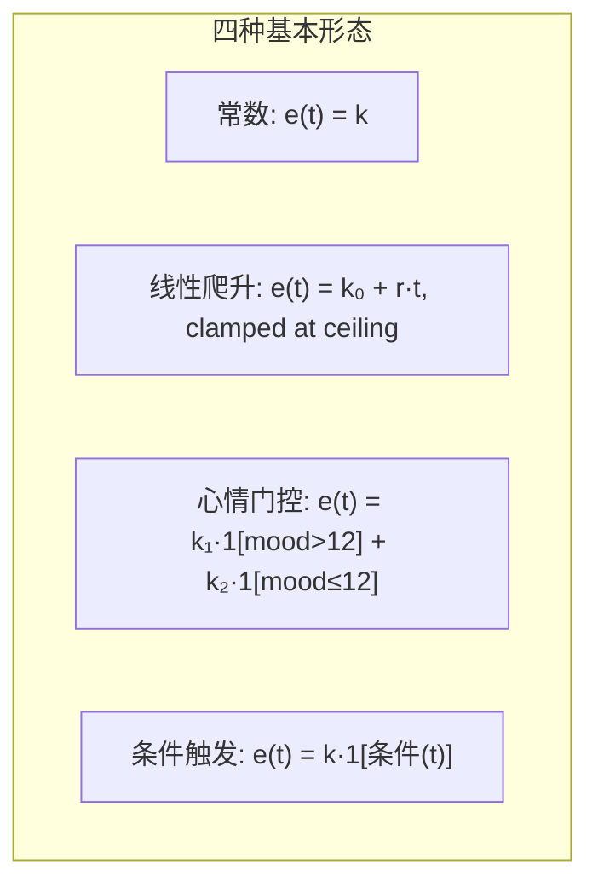
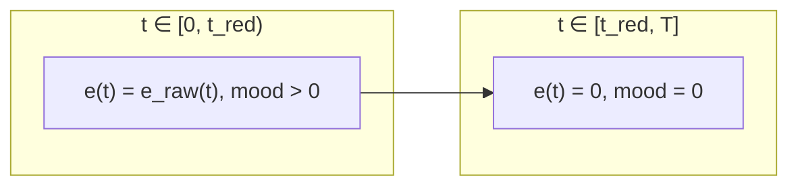

# 效率函数统一建模（草案）

> **状态**：草案 (Draft) — 全部设计问题已决议，待进入实现
>
> **依赖决策**：分组模型 ([上轮讨论](#6-与分组模型的关系))、跨设施组表达方式、`buffs_infrastructure.json` 数据层选型

## 1. 动机

### 1.1 当前架构的问题

当前产出计算与心情计算分散在两个独立的模块中：

| 模块 | 行数 | 职责 | 局限 |
|------|:---:|------|------|
| `production.py` | 253 | Mfg / Trade / Power 的日产出 | 硬编码 `hours=24`，假设全天满效率运行 |
| `mood.py` | 169 | 工作心情消耗 + 中枢减免 | 仅判断蓝脸/红脸，**注意力涣散对产出的影响完全不参与计算** |

核心矛盾在于两者使用不同的抽象：

```python
# production.py: 常数效率 × 小时数
output_per_day = _GOLD_BASE_PER_HOUR * 1.26 * 24  # ← 假设 24h 全速

# mood.py: 计算 24h 后剩余心情
remaining = 24.0 - (1.0 - control_bonus) * 24  # ← 可能 < 0，但 production 不知道
```

`production.py` 永远不知道一个干员在 24h 班的第 16 小时已经红脸——它假设全天满效率。

### 1.2 不可回避的时变技能

`buffs_infrastructure.json` 中存在**7 条随时间变化的技能**：

| buff_id | 形态 | 描述 |
|---------|------|------|
| `power_rec_spd&addition[000]` ~ `[001]` | 首小时 10~15%, +1%/h, 上限 15~20% | 发电站无人机充能爬升（2条） |
| `manu_prod_spd_addition[030]` ~ `[041]` | 首小时 15~20%, +1~2%/h, 上限 25% | 制造站生产力爬升（4条） |
| `meet_spd_hast[000]` | 首小时 20%, +2%/h, 上限 30% | 会客室线索搜集爬升（1条） |

这些技能无法用一个标量 `efficiency` 字段描述——它们的效率是时间的函数。

### 1.3 设计目标

将 Mfg / Trade / Power / Mood 四种计算路径**统一归约为同一个数学对象**：效率对时间的函数 `e(t)`，产出 = `∫ e(t) · base_rate dt`。

## 2. 数学模型

### 2.1 核心定义

设排班时长为 `[0, T]`（单位：小时），某设施房间有 `n` 名干员，其各自技能效率函数为 `e₁(t), e₂(t), ..., eₙ(t)`（百分值，如 30 表示 +30%），则房间总生产力为：

```
P(t) = 1 + 0.01·n + Σᵢ eᵢ(t) / 100
```

房间在 `[0, T]` 内的总产出为：

```
产出 = base_rate × ∫₀ᵀ P(t) dt
```

其中 `base_rate` 取决于设施类型和产物（赤金 = 0.833/h，作战记录 = 0.333/h，龙门币 = 1/3.39 订单/h）。

### 2.2 分类学

所有技能的 `e(t)` 均属于以下四种基本形态的有限组合：



| 形态 | e(t) 表达式 | 实际数量 | 示例 |
|------|------------|:---:|------|
| 常数 | `k` | ~555 | `manu_prod_spd[000]` efficiency=15 |
| 线性爬升 | `min(k₀ + r·t, ceiling)` | 7 | "首小时+15%, 此后+1%/h, 上限+20%" |
| 心情门控 | `k₁ 或 k₂`（阈值切换） | ~15 | mood<12→人间烟火+15, mood>12→感知信息+10 |
| 条件触发 | `0 或 k`（配对/阵营联动） | ~150 | "当与推进之王在同一贸易站时+35%" |

条件触发与前三种形态有本质区别：其条件不是单干员自身状态（时间/心情），而是**同房间其他干员的存在性**。例如"格拉斯哥帮每有 1 名成员 +20%"需要跨干员计数，其 e(t) 不能由单个干员独立求出。此类技能归入**体系联动**（§3.3 `synergy_efficiency`），以全房间干员列表为输入。

> 除极少数技能外，心情对效率的影响集中在 `mood=0` 时的注意力涣散——此时所有技能的 `e(t)` 归零。不发生连续衰减，见 §2.3。

### 2.3 心情与效率

游戏内心情-效率的主要边界是 `mood = 0` 时的**注意力涣散**状态（此时"后勤技能和基础效率在内的大部分加成会失效"）。极少数制造站技能（1 条）在 mood > 0 阶段存在额外的心情梯级衰减，见本节末尾。

设工作干员净心情消耗率为 `burn`（含中枢减免），则 `mood(t) = 24 - burn·t`。对于绝大多数技能，效率函数仅在 mood 归零时截断：

```
e(t) = e_raw(t) × 1[mood(t) > 0]

截断点: t_red = 24 / burn  — 注意力涣散，效率归零
```

这意味着此类 e(t) 在时间轴上切分为 **2 段**（满效率 → 归零），退化为最简单的分段常数。心情衰减不产生连续的效率降低——只有阈值跳变。

#### 梯级衰减：心情对生产力的缩进

`manu_prod_spd_reduce[000]`（"模糊视线"，持有者铅踝）是唯一直接产生 mood→e(t) 连续衰减的制造站技能：描述为"生产力+30%，每4点心情落差→生产力-5%"。数学表达：

```
e(t) = 30 - 5 × ⌊(24 - mood(t)) / 4⌋   for mood(t) > 0
     = 0                                    for mood(t) = 0（注意力涣散）
```

mood 从 24 降至 0 过程中依次在 20、16、12、8、4 五个断点处各扣 5%，最终归零。`to_segments()` 根据 `burn` 在 `t ∈ [0, t_red)` 区间内切出至多 5 个中间截断段——属于 `constant_efficiency` 的变体参数（标记 mood 梯级衰减步长），不引入新形态。

#### mood(0)=24 的前提与多班次验证

`mood(t) = 24 - burn·t` 隐含假设上一班次结束后心情已回满。这一假设在多班次（一天三换/四换）场景下是否成立？

| 班次 | 工作时间 | 恢复窗口 | 最低恢复量 (1.6/h) | 最大消耗量 | 满状态 |
|------|:---:|:---:|:---:|:---:|:---:|
| 一天一换 | 12~24h | — | — | — | 不适用（单班，无轮换） |
| 一天两换 | 12h | 12h | 19.2 | 7.8 | ✅ |
| 一天三换 | 8h | 16h | 25.6 | 5.2 | ✅ |
| 一天四换 | 6h | 18h | 28.8 | 3.9 | ✅ |

> 数值取典型配置：3 人房间 burn=0.65/h（基值 0.90 − 中枢减免 0.25）。最差单人工位 burn=1.5/h 时，8h 消耗 12 → 16h 恢复 25.6 → 仍满。

前提：strategy-brief.md 的多班次策略——**每班用不同干员**，单名干员一天只工作一班。在此策略下，e(t) 模型无需感知宿舍恢复速率——那是求解器层面的容量约束（"是否有足够干员支撑 N 班 × 29 工位"），不是 e(t) 层面的建模问题。

**MAA 极限模板验证**（`243_layout_4_times_a_day.json`）：社区公认的最优一天四换模板实际使用 8-8-4-4 四班结构。实证确认：

- 工作干员每班 ≤ 8h，`mood(0)=24`，burn≈0.65~0.90/h → 班后剩余 ≥ 17h → 满恢复可行
- 部分核心干员（巫恋/龙舌兰）跨班连续工作 16h，但依赖 MAA 内置菲亚梅塔心情恢复机制补充——模型忽略恢复后偏保守（安全侧偏差）
- 令的 mood 被手动削至 12 是 buff 体系战术（触发 mood 门控产出人间烟火），不属于 e(t) 计算链
- 结论：e(t) 模型假设群（mood(0)=24, burn 常数, 无班内恢复干扰）与实际极限模板**安全兼容**——模型预测产出 ≤ 实际产出

e(t) 模型唯一需要关心的跨班次边界是：若求解器出于 box 不足而**复用干员**（同一人连续工作两班），则 `mood(0) < 24`。此时需由求解器在调用 `to_segments()` 时传入实际起始心情值以计算正确的 `t_red`。v1 不处理此场景（假定独立排班始终可行）。

#### burn 的常数性验证

`burn` 含中枢减免后的净值。需确认中枢干员自身的心情变化不会导致 `burn` 在一个班次内漂移。反查所有对工作干员 `burn` 有直接影响的 Control 技能：

| 技能 | 工作恢复效果 | 是否 mood 门控 |
|------|-------------|:---:|
| 孤光共照 (凯尔希) | "其他设施工作干员 +0.05/时" | 否 — 基础 +0.05 常驻 |
| 巴别塔之帜 | "其他设施工作干员 +0.1/时" | 否 |
| 控制中枢基础 | 每名中枢干员 +0.05/时 | 否 |

对工作 `burn` 有直接影响的恢复效果全部**无 mood 门控**。mood 门控仅影响 buff 体系（人间烟火/感知信息的生产量），而 buff 池波动不足以跨越孤光共照的 20 点档位阈值。`burn` 在单班次内为常数——即使 48h 班也不变。v1 直接将 `mood_burn` 建模为标量 `float`。

> 48h 班触发的实际边界是 `t_red = 24/burn ≈ 37h`——工作干员在 [37h, 48h] 效率=0。这是 e(t) 积分自然处理的截断，不是 `burn` 时变问题。多班次策略下每人 ≤12h，此边界不触发。



## 3. 实现策略：分段线性积分

### 3.1 为什么是分段线性

所有四种形态在分段后都是形如 `e(t) = a + b·t` 的线性函数：

| 原始形态 | 在段内的线性表达 |
|----------|-----------------|
| 常数 k | `a=k, b=0` |
| 线性爬升 k₀ + r·t | `a=k₀, b=r`（到 ceiling 截断） |
| 心情门控 | 段内为常数 `a=k₁, b=0`（以 mood 阈值为界切段） |
| 体系联动 | `a=Σk, b=0`——房间级聚合后输出常数段 |
| 注意力涣散 (mood=0) | `a=0, b=0`（段内效率归零） |

所有最终需要积分的表达式均为 `∫(a + b·t) dt`，闭式解为 `a·Δt + b·(t₁² - t₀²)/2`。**无需数值积分库，无需 scipy。**

房间总生产力 `P(t) = 1 + 0.01n + Σ eᵢ(t)/100` 是各干员 e(t) 的线性求和。由积分的线性性质，`∫ Σ eᵢ = Σ ∫ eᵢ`——每个干员的片段各自独立积分后加和，无需合并时间边界。

### 3.2 核心数据结构

```python
@dataclass
class LinearSegment:
    """e(t) 的一个线性片段: e(t) = a + b·t, t ∈ [t_start, t_start + dt]"""
    a: float       # 截距（百分值，如 30 表示 +30%）
    b: float       # 斜率（百分值/h，如 -2.5 表示 -2.5%/h）
    t_start: float # 起始时间 (h)
    dt: float      # 持续时间 (h)

    def integrate(self) -> float:
        """∫(a + b·t) dt over [t_start, t_start+dt]"""
        t0, t1 = self.t_start, self.t_start + self.dt
        return self.a * self.dt + self.b * (t1**2 - t0**2) / 2.0
```

### 3.3 主要构造器

| 构造器 | 粒度 | 输入 | 用途 |
|--------|------|------|------|
| `constant_efficiency(value, mood_burn)` | per-operator | 技能值 + 心情消耗率 | 常数技能。mood_burn>0 时在 t_red 截断为两段 |
| `ramping_efficiency(initial, gain, ceiling, mood_burn)` | per-operator | 起始/增量/上限 | 7 条时变技能，饱和后由 mood_burn 附加截断段 |
| `synergy_efficiency(operators, room_type, product)` | per-room | 全房间干员列表 | ~150 条配对/阵营联动，跨干员判定后输出聚合常数段 |

> `mood_burn`：不传（或传 0）→ 无限时常数段；传入正数 → 在 `t_red = 24/burn` 处截断为两段。
>
> `synergy_efficiency` 内部按体系拆分为独立函数（如 `_glasgow_synergy`、`_witch_combo` 等），由注册表 dispatch。各体系并行计算后线性叠加——游戏内体系效果本即加法，利用 `∫ Σ = Σ ∫` 分别积分后求和。

### 3.4 求解器集成

求解器在两个阶段使用 e(t)：

| 阶段 | 用途 | 使用方式 |
|------|------|----------|
| **贪心排序** | 判断干员优先级 | e(t) 支配偏序——利用分段线性结构做无损比较 |
| **方案评估** | 计算最终日产 | `∫₀ᵀ e(t) dt` 全积分——含注意力涣散截断和时变技能 |

#### 贪心排序：e(t) 支配偏序

不使用标量投影（e(0) 或全积分）排序，而是利用 e(t) 的分段线性结构构建**支配偏序**（dominance partial order）：

```
A 支配 B  ⇔  e_A(t) ≥ e_B(t)  for all t ∈ [0, T]
```

| 情况 | 含义 | 处理 |
|------|------|------|
| A 支配 B | A 在任何时刻都不比 B 差 | A 无条件优先于 B |
| B 支配 A | 对称 | B 无条件优先于 A |
| 互不支配（曲线交叉） | 真实歧义 — 无标量可无损解决 | 退化为全积分比较 |

支配关系是信息无损的——保留了 e(t) 的全部时变特征。纯 e(0) 排序丢弃时变信息，会错排"起跑快但续航差"的干员。例如 A(e=40, burn=1.5/h → t_red=16h) 与 B(e=30, burn=0.65/h → t_red=37h) 在 24h 班次下曲线交叉，支配关系正确识别歧义后由全积分选 B。

算法实现：

```python
def rank_by_dominance(candidates: list[tuple[list[LinearSegment], Operator]],
                      T: float) -> list[Operator]:
    """基于 e(t) 支配偏序的多趟拓扑输出"""
    n = len(candidates)
    # 1. 构建支配 DAG: i → j 若 e_i 支配 e_j
    graph = {i: set() for i in range(n)}
    in_degree = {i: 0 for i in range(n)}
    for i in range(n):
        for j in range(n):
            if i != j and _dominates(candidates[i][0], candidates[j][0], T):
                graph[i].add(j)
                in_degree[j] += 1

    # 2. 多趟 Kahn: 每趟取极大元
    remaining = set(range(n))
    result = []
    while remaining:
        maximal = [i for i in remaining if in_degree[i] == 0]
        if len(maximal) == 1:
            best = maximal[0]
        else:
            # 互不支配 → 全积分比较
            best = max(maximal, key=lambda i: _integral_segments(candidates[i][0], T))
        result.append(candidates[best][1])
        remaining.remove(best)
        for j in graph[best] & remaining:
            in_degree[j] -= 1
    return result


def _dominates(seg_a: list[LinearSegment], seg_b: list[LinearSegment],
               T: float) -> bool:
    """O(seg_a + seg_b): 在所有分段端点处比较"""
    breakpoints = sorted({
        seg.t_start for seg in seg_a + seg_b
        if seg.t_start <= T
    } | {T})
    return all(
        _eval_segments(seg_a, t) >= _eval_segments(seg_b, t)
        for t in breakpoints
    )
```

性质：

- 支配检查简化为 O(1) 二维比较（效率值 + 有效时长），仅 ramp 技能退化到分段遍历
- 候选池 N ≤ 20 → DAG 构建 ≤ 400 次 O(1) 比较，Python < 0.1ms
- 贪心排序行从 `candidates.sort()` 替换为 `rank_by_dominance(candidates, T)`
- 贪心填充的其余逻辑（逐槽位、冲突回溯）不变。回溯触发频率显著降低——支配关系消除了大部分假歧义

#### 支配偏序的简化

修正心情模型（§2.3）后，e(t) 退化为两段：常数到 `t_red` 然后归零。支配关系随之大幅简化——无需遍历分段端点：

```python
def _dominates_simple(seg_a: list[LinearSegment], seg_b: list[LinearSegment],
                      T: float) -> bool:
    """O(1): 两段阈值模型下，支配退化为值+时长的二维比较

    e(t) 恒为常数 k 截断在 t_red:
      A dominates B iff k_A >= k_B AND t_red_A >= t_red_B
    """
    k_a, t_a = _key_values(seg_a, T)
    k_b, t_b = _key_values(seg_b, T)
    return k_a >= k_b and t_a >= t_b

def _key_values(seg: list[LinearSegment], T: float) -> tuple[float, float]:
    """提取 e(t) 的常数值和有效时长"""
    k = seg[0].a  # 常数值
    t_end = seg[-1].t_start + seg[-1].dt  # 归零点
    return k, min(t_end, T)
```

> ramp 技能（7条）的饱和时间 ≤5h，`_key_values` 取其 e(t) 平均值作为代理 k，精确支配仍用通版 `_dominates()`。绝大多数场景走 O(1) 快捷路径。

## 4. 架构影响

### 4.1 模块职责

```text
efficiency_fn.py   — 统一 e(t) 模型：LinearSegment、三种构造器、积分、支配偏序
production.py      — 薄适配层：base_rate × ∫P(t) dt → 日产数值
models.py          — 数据模型：Operator、Skill、EfficiencyMap（不耦合 e(t) 实现）
```

`mood.py` 的逻辑被 e(t) 吸收——心情的阈值效应（注意力涣散）通过 `mood_burn` 参数表达的 `t_red` 截断自然处理。`MoodReport` 全部诊断字段等价于 e(t) 的分段信息：红脸 = `e(t)=0` after `t_red`，蓝脸无实际游戏效果。班后剩余心情在固定排班下无决策价值，不纳入 e(t) 模型。

### 4.2 与求解器接口

```python
# 求解器调用方式（伪代码）
def evaluate_shift(plan: ShiftPlan, operators: list[Operator],
                   shift_hours: float = 12.0) -> DailyProduction:
    # 1. 计算全局心情参数
    global_burn = _calc_global_burn(plan, operators)

    # 2. 每个工作房间: 构造 e(t) → 积分 → 产出
    for room in plan.work_rooms:
        op_segments = [op.to_segments(room.product, global_burn) for op in room]
        synergy_segments = synergy_efficiency(room.operators, room.room_type, room.product)
        productivity = room_productivity_integral(op_segments + synergy_segments, shift_hours)
        output = room.base_rate * productivity

    # 3. 赤金供需平衡（保持现有逻辑）
```

### 4.3 数据模型扩展

`Skill` 提供 per-operator 的 e(t) 入口：

```python
class Skill:
    buff_id: str
    buff_name: str
    skill_icon: str
    room_type: str
    efficient: EfficiencyMap
    phase: int

    def to_segments(self, mood_burn: float = 0.0) -> list[LinearSegment]:
        """将技能效率值转换为 e(t) 分段序列"""
```

`Operator` 聚合自身全部技能，并附带身份元数据供体系联动判定：

```python
class Operator:
    char_id: str
    name: str
    rarity: int
    skills: list[Skill]
    group_id: str | None       # 阵营/组织 ID（如 "glasgow", "rhine"）
    nation_id: str | None      # 势力 ID（如 "sargon", "rim"）
    team_id: str | None        # 队伍 ID（如 "action4"）

    def to_segments(self, room_type: str, product: str,
                    mood_burn: float = 0.0) -> list[LinearSegment]:
        """该干员独立技能的 e(t)，不含体系联动"""
```

`EfficiencyMap` 保持不变——原始效率值容器仅做查表，不参与 e(t) 构造。

## 5. 覆盖度验证

用实际数据验证每种机制的覆盖情况：

| 机制实例 | 能否表达为 e(t)？ | 方式 |
|----------|:---:|------|
| 制造站简单加成 (efficiency=15) | ✅ | `constant_efficiency(15, burn)` |
| 贸易站简单加成 (efficiency=30) | ✅ | `constant_efficiency(30, burn)` |
| 发电站无人机加成 (efficiency=20) | ✅ | `constant_efficiency(20)` — 发电站不消耗心情 |
| 时变制造效率 (首小时+15%,+2%/h) | ✅ | `ramping_efficiency(15, 2, 25, burn)` |
| 时变发电站效率 (首小时+10%,+1%/h) | ✅ | `ramping_efficiency(10, 1, 15)` |
| 心情门控 (mood<12→+15, mood>12→+10) | ✅ | 两段 constant，以 mood=12 为界切换 |
| 同设施配对 (巫恋+龙舌兰+卡夫卡) | ✅ | `synergy_efficiency` 识别房间成员，组合条件满足时输出聚合常数段 |
| 阵营计数 (每名格拉斯哥帮+20%) | ✅ | `synergy_efficiency` 内部跨干员计数后计算加成 |
| 跨设施 buff (中枢→心情恢复) | ✅ | 两层计算：先算 global_burn，再传入房间 e(t) |
| 自动化 (其他干员效率归零) | ✅ | 仅 `e_auto(t)` 非零，其他干员 `e(t)=0` |

## 6. 与分组模型的关系

效率函数模型和分组模型是**正交互补**的：

```
分组模型（选谁）             效率函数模型（产多少）
─────────────────────      ─────────────────────
ProductionGroup             效率 = ∫₀ᵀ e_group(t) dt
  ├── slots: [Trade×3]     e_group(t) = Σ op.to_segments(t)
  ├── operators: [...]           + synergy_efficiency(operators, …)
  └── full_efficiency: N    N 是 e_group(t) 在 T 内的积分结果
```

分组模型负责**确定干员组合**，效率函数模型负责**精算该组合的实际产出**。两者通过以下方式交互：

| 交互点 | 分组模型提供 | 效率函数模型提供 |
|--------|-------------|-----------------|
| 独立效率 | 组内干员列表 | per-operator `to_segments()` 积分（含注意力涣散截断） |
| 体系联动 | 组内干员列表 | `synergy_efficiency(operators)` → 配对/阵营聚合产出 |
| 降级链 | 缺人时的替代组合 | 降级组合的积分产出 |
| 跨设施组 | 全局恢复参数 | mood_burn 的改变量 |

分组模型中的 `full_efficiency` 不再需要是固定标量——它变为 `e_group(t)` 在全时段积分的结果。

## 7. 参考

- [constraints-and-data-baseline.md](./constraints-and-data-baseline.md) §2.3.3 — 宿舍与中枢恢复链（mood_burn 的全局参数来源）
- [constraints-and-data-baseline.md](./constraints-and-data-baseline.md) 附录 A — 数据溯源基线
- [strategy-brief.md](./strategy-brief.md) §策略 — 贪心求解框架
- [PRTS Wiki / 制造站](https://prts.wiki/w/%E7%BD%97%E5%BE%B7%E5%B2%9B%E5%9F%BA%E5%BB%BA/%E5%88%B6%E9%80%A0%E7%AB%99) — 生产力公式
- [PRTS Wiki / 控制中枢](https://prts.wiki/w/%E7%BD%97%E5%BE%B7%E5%B2%9B%E5%9F%BA%E5%BB%BA/%E6%8E%A7%E5%88%B6%E4%B8%AD%E6%9E%A2) — 心情恢复机制
