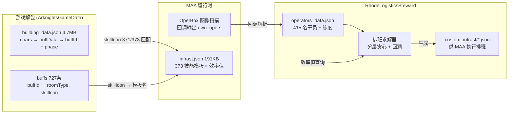
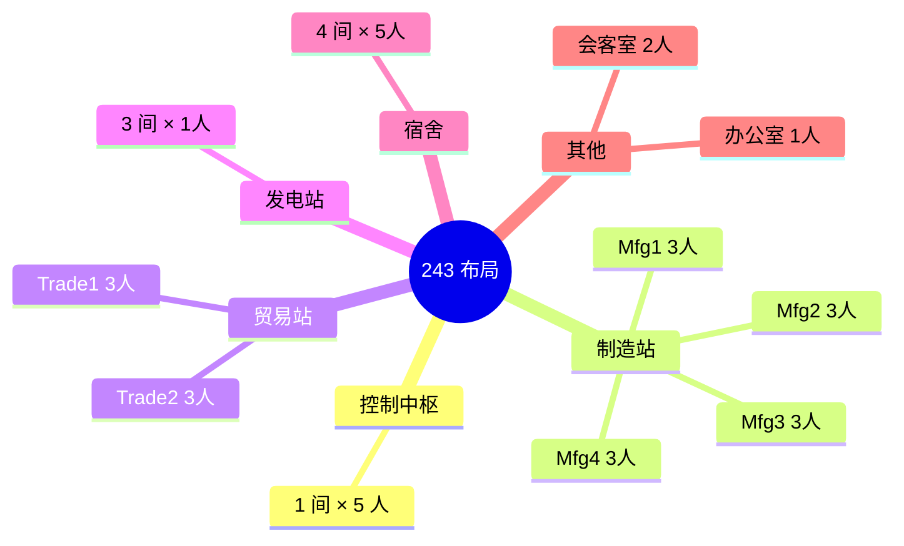
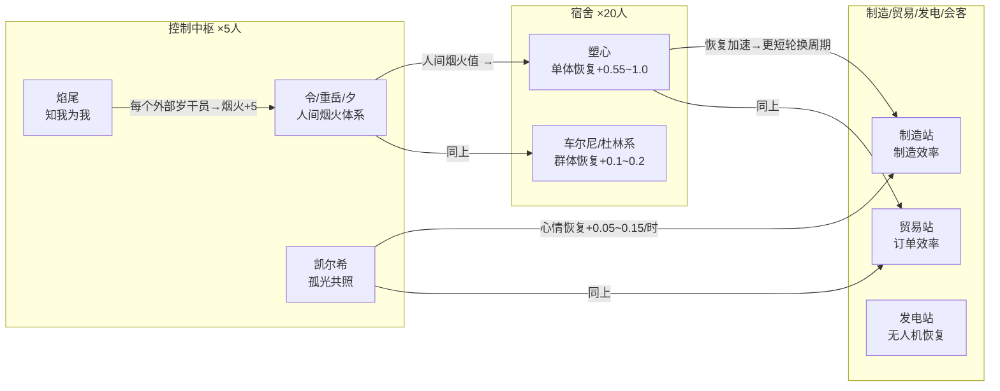
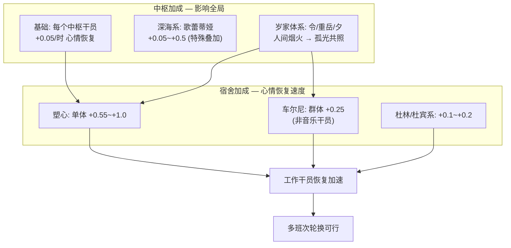
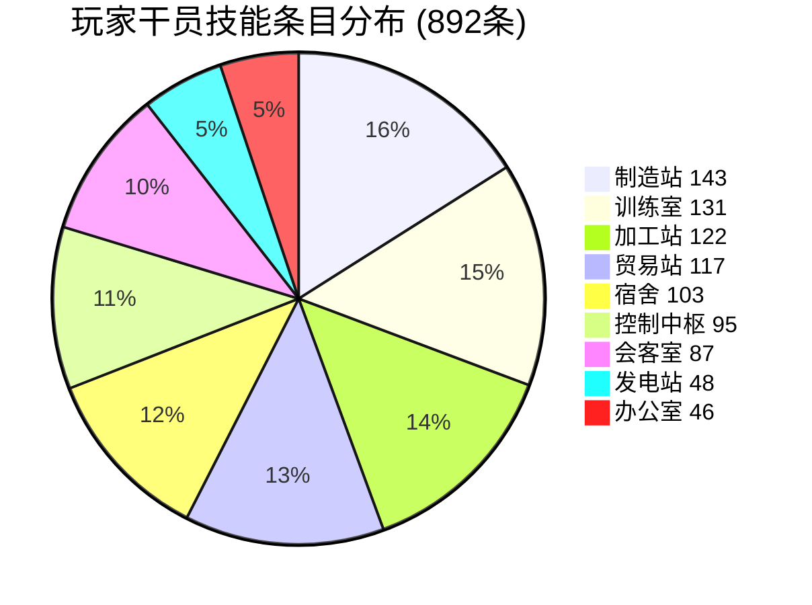
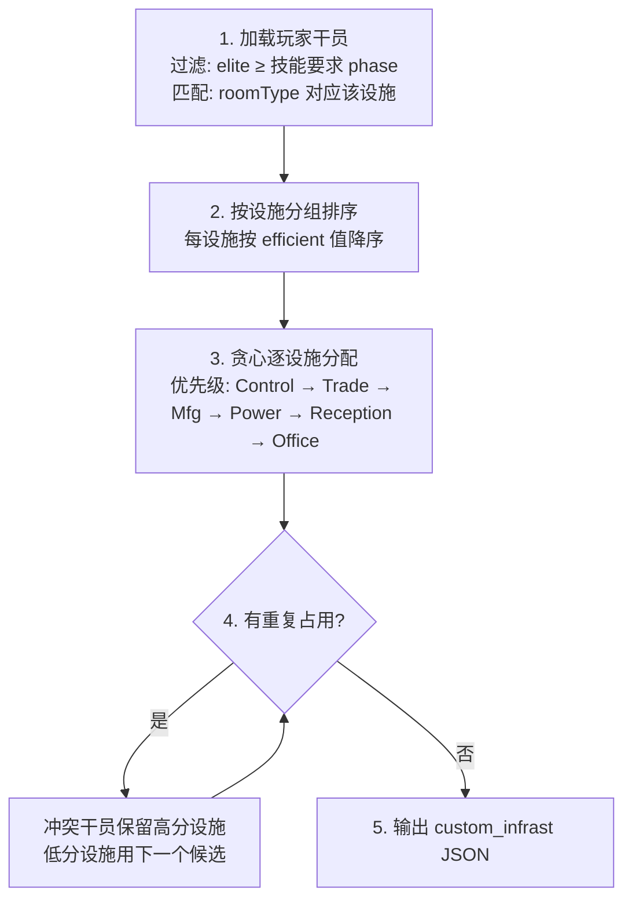
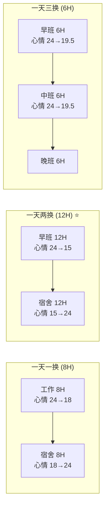
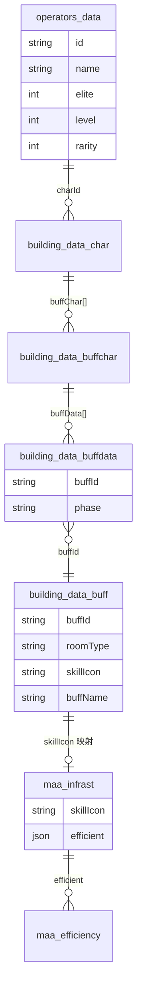

# 基建排班约束体系与求解策略评估

## 1. 数据全景图

排班问题的完整数据链路：



### 1.1 当前账号数据

| 维度 | 数值 |
|------|------|
| 总干员 | **415** 名 |
| 精英2 / 精英1 / 精英0 | 170 / 55 / 190 |
| 可用基建干员(精1+) | **225** 名 |
| 6★ / 5★ / 4★ / 3★ / 2★ / 1★ | 131 / 191 / 61 / 17 / 5 / 10 |

### 1.1.1 building_data.json 覆盖度验证（2026-05-26）

| 验证项 | 结果 |
|--------|------|
| 玩家干员 ↔ building_data chars | **100%** (415/415 完全匹配) |
| 玩家干员总技能条目 | **892** 条（平均每干员 2.15 个技能） |
| buffs 唯一 buffId 池 | **727** 个，全部被玩家干员使用 |
| MAA infrast.json ↔ building_data skillIcon | **371/373** 高度吻合 |
| building_data 中仅在 BD 的额外 skillIcon | 141 个（训练室/加工站等 MAA 不跟踪效率的技能） |

**仓库维护状态**: `Kengxxiao/ArknightsGameData` 由机器人 `Vulpisfoglia_BOT` 自动维护，随国服客户端版本更新推送。最新提交 2026-05-22，更新频率约 **每 2~8 天一次**，与明日方舟游戏版本同步。

### 1.2 设施容量（以 243 布局为例）

| 设施 | 房间数 | 每间人数 | 总工位 | 效率字段 |
|------|--------|----------|--------|----------|
| 控制中枢 Control | 1 | **5** | 5 | 心情恢复 |
| 贸易站 Trade | 2 | **3** | 6 | Money(龙门币)/SyntheticJade(源石碎片) |
| 制造站 Manufacture | 4 | **3** | 12 | CombatRecord/PureGold/OriginStone/Chip |
| 发电站 Power | 3 | **1** | 3 | Drone(无人机恢复) |
| 会客室 Reception | 1 | **2** | 2 | General/No1~No7(线索搜集) |
| 办公室 Office | 1 | **1** | 1 | HR(人脉联络) |
| 宿舍 Dormitory | 4 | 5 | 20 | 心情恢复(不参与效率) |

> 核心工位 = 29，干员/工位比 = **7.8:1**。  
> 这意味着约束复杂度不在"有没有人"，而在"选谁最好"——典型的**组合优化**问题。


> 核心工位 = 5 + 12 + 6 + 3 + 2 + 1 = **29 人**；干员/工位比 = 225/29 ≈ **7.8:1**

---

## 2. 约束条件体系

排班问题中的约束可以分为三类：硬约束（不可违反）、软约束（需要优化）和联动约束（跨设施连锁）。

### 2.1 硬约束（Hard Constraints）

| # | 约束 | 说明 |
|---|------|------|
| H1 | 每设施人数上限 | Control≤5, Trade≤3/间, Mfg≤3/间, Power≤1/间, Reception≤2, Office≤1 |
| H2 | 每干员唯一占用 | 一个干员同时只能在**一个**设施的**一个**工位 |
| H3 | 技能解锁条件 | **实测**: PHASE_0 = 451个, PHASE_1 = 87个, PHASE_2 = 354个。当前玩家可解锁 687/892 个技能（205 个未达成） |
| H4 | 设施类型匹配 | 干员只能进驻其技能适用的设施（技能 `roomType` 决定） |
| H5 | 产物类型匹配 | 制造站的当前产物必须匹配干员的技能（如做赤金时，仅赤金相关技能生效） |

### 2.2 软约束（Soft Constraints / 优化目标）

| # | 约束 | 说明 |
|---|------|------|
| S1 | 效率最大化 | 在合规前提下追求最高综合产出效率 |
| S2 | 心情平衡 | 避免同一设施干员同时心情耗尽导致产能断档 |
| S3 | 宿舍恢复 | 宿舍内干员需提供足够的心情恢复速率以支撑轮换 |
| S4 | 会客室线索轮换 | 会客室只需凑齐线索，非效率优先场景可降低优先级 |

### 2.3 联动约束（Combinatorial / Cross-facility）

这是排班问题**最复杂的部分**——技能描述中大量"如果 X 在 Y 则 +Z%"类型的条件。

#### 2.3.1 同设施联动（Local Combo）

同一设施内干员之间存在直接联动：

| 联动类型 | 示例 | 涉及技能数 |
|----------|------|-----------|
| **干员配对** | 巫恋+龙舌兰+卡夫卡 → 贸易站效率组合 | Trade: 9个配对 |
| **阵营联动** | 格拉斯哥帮干员同贸易站 → 推王额外+35% | Trade: ~10个阵营 |
| **同类加成** | 每个"标准化"技能为多萝西+5% | Mfg: ~5个互动系 |
| **相邻影响** | 拉普兰德+德克萨斯 → 订单上限+4 | Trade 特定 |

#### 2.3.2 跨设施联动（Cross-facility Cascade）

干员在不同设施之间的互动形成**连锁效应**：



> 核心链: **中枢体系 → 宿舍恢复速率 → 全设施轮换速度**，多班次运转的关键。

#### 2.3.3 宿舍与中枢的恢复链

这是维持多班次运转的核心机制：



---

## 3. 基础设施技能分类学

### 3.0 实测数据



| 设施 | 技能条目数 | MAA 技能模板数 | 排班相关 |
|------|-----------|---------------|----------|
| 制造站 MANUFACTURE | 143 | 84 | ✅ 核心 |
| 贸易站 TRADING | 117 | 74 | ✅ 核心 |
| 控制中枢 CONTROL | 95 | 67 | ✅ 核心 |
| 宿舍 DORMITORY | 103 | 52 | ✅ 核心 |
| 会客室 MEETING | 87 | 48 | ✅ 核心 |
| 发电站 POWER | 48 | 15 | ✅ 核心 |
| 办公室 HIRE | 46 | 33 | ✅ 核心 |
| 训练室 TRAINING | 131 | — | ❌ 专精用 |
| 加工站 WORKSHOP | 122 | — | ❌ 合成用 |

> 训练室和加工站虽 building_data 中有定义，但 MAA 基建排班不涉及——排班求解时无需考虑。

### 3.1 制造站技能谱系

| 类型 | 特征 | 顶级干员 |
|------|------|----------|
| **通用高加成** | `all=30+` | 至简(30), 弑君者(30), 食铁兽(30) |
| **赤金特化** | `PureGold=25+` | 清流+温蒂+森蚺(自动化体系) |
| **作战记录特化** | `CombatRecord=30+` | 野鬃+远牙+灰毫(红松骑士团) |
| **源石碎片** | `OriginStone=30+` | 阿罗玛(35+10) |
| **仓库容量联动** | 每格仓库+1~3% | 多萝西, 掠风, 龙舌兰(挂名) |
| **阵营Buff** | 同制造站内A1/莱茵科技/标准化联动 | 详见Mfg联动表 |

### 3.2 贸易站技能谱系

| 类型 | 特征 | 顶级干员 |
|------|------|----------|
| **纯效率** | 30~40% | 但书(30+隐藏机制), 黑键(40), 吉星(35) |
| **效率+订单上限** | 效率25~30%+上限调节 | 巫恋+龙舌兰+卡夫卡(体系), 德克萨斯+拉普兰德 |
| **订单差异类** | 订单数vs上限→效率 | 伺夜(差值*4%), 可露希尔(特殊机制) |

### 3.3 会客室技能谱系

| 类型 | 示例 |
|------|------|
| 基础搜集速度 | 10~35% (信仰搅拌机35%单人最高) |
| 特定线索倾向 | 格拉斯哥帮(因陀罗), 喀兰(初雪), 罗德岛(微风)... |
| 联动加成 | 铃兰+提丰+30%, 黑钢系+15% |

---

## 4. 求解策略设计

### 4.1 核心思路

排班问题的本质是**每设施选当前最优 N 人，不重复占用即可**。不应预设"全 box + 高频换班"的理想条件——联动/体系是锦上添花，缺 box 或低频换班时完全不需要。

不同玩家场景下，求解策略自然分档：

| 场景 | 策略 | 复杂度 |
|------|------|--------|
| 一天一换 / box 不全 | **单班次贪心** | O(N log N) |
| 一天两换 | 单班次贪心 × 2（两套人马各解一遍） | 同上 |
| 一天三换 + 全 box | 贪心 + 可选联动校验 | 同上，联动是后校验不是驱动力 |

### 4.2 单班次求解（默认基线）



算法等同于：对每个设施追问 **"我手里还有谁能胜任？排前面的没被占吧？放进去。"**

```python
def solve_single_shift(operators, layout):
    assigned = {}  # op_id → facility
    for facility in ["Control", "Trade", "Mfg", "Power", "Reception", "Office"]:
        slots = layout[facility]
        candidates = rank_operators(operators, facility, exclude=assigned)
        for i in range(slots):
            if i < len(candidates):
                assigned[candidates[i].id] = facility
            else:
                mark_autofill(facility)  # 候选不足，委托 MAA 补位
    return to_json(assigned, layout)
```

### 4.3 多班次

同一组干员无法支撑高频换班。处理方式：把候选池按换班次数切分为 N 份，每份独立执行单班次贪心。候选不足时房间标记 `autofill: true` 委托 MAA 补位。

### 4.4 联动处理（可选后校验）

联动**不作为驱动因素**，贪心结束后检查：

- 玩家凑齐了知名组合全成员 → 标记锁定，重新贪心时将组合固化为单元
- 缺成员 → 不处理，剩余位置正常贪心
- box 太小 / 低频换班 → 整个步骤跳过

> 一天一换时"人间烟火→孤光共照"中枢大体系无意义——不轮换就不需要那点额外恢复速度。

### 4.5 效率排序

直接使用 MAA `infrast.json` 的 `efficient` 值做排序键——不精确计算，只排序。最终效率由 MAA 自行计算，我们只需要给出"先用谁"的顺序。

| 参数 | 典型值 |
|------|--------|
| 中枢干员心情消耗 | 0~1.5/时 (取决于技能组合) |
| 工作干员心情消耗 | 通常 0.75/时 |
| 宿舍恢复速率 | 1.5~3.0/时 (取决于宿舍配置) |
| 心情上限 | 24 |
| 蓝脸阈值 | <12 (效率开始下降) |
| 红脸阈值 | <0 (效率为0) |

**推荐默认策略**：12H一换（一天两班），与 MAA 内置的 `243_layout_4_times_a_day.json` 类似。



---

## 5. 算法复杂度与优化

### 5.1 复杂度估算

| 层级 | 算法 | 复杂度 |
|------|------|--------|
| L1 中枢 | 枚举中枢5人组合 | C(15~20,5) ≈ 15,504 可接受 |
| L2 宿舍 | 贪心选每间最优恢复 | O(N_dorm), 单次扫描 |
| L3 联动组 | 图匹配(已知联动模板) | O(N_templates * N_opers) |
| L4 设施填充 | 排序+贪心 | O(N_opers log N_opers) |
| L5 回溯 | 局部搜索 | O(N_conflicts * K_depth) |

总时间：在 225 名干员的规模下，Python 实现预计 **< 1 秒**完成一次求解。

### 5.2 记忆化缓存

由于基建技能数据变化频率低（仅游戏版本更新时变动），可预计算：
- 每设施对每个干员的**独立效率评分**（不考虑联动）
- 每个联动组的**综合效率**
- 每个中枢体系的**全局影响评估**

### 5.3 多方案生成

求解器应输出 **Top-K 方案**（如 K=5），而非单一方案，让用户有选择空间：
- K 越大，可权衡效率 vs 是否有所需干员的取舍
- 通过调整 L5 的回溯深度参数，可控制方案多样性

---

## 6. 下一步工作

| 步骤 | 内容 | 预计产出 | 状态 |
|------|------|----------|------|
| ① 下载数据 | 获取 `ArknightsGameData/building_data.json` | 干员→技能映射表 (4.7MB) | ✅ 已完成 |
| ② 数据预处理 | 联合 `infrast.json` 构建完整效率表 + 覆盖度验证 | `operator_efficiency.json` + 基线验证脚本 | ✅ 已完成 |
| ③ 实现 L1~L2 | 中枢+宿舍求解器 | 核心恢复链 | 待开始 |
| ④ 实现 L3 | 联动组识别与匹配 | 已知组合模板 | 待开始 |
| ⑤ 实现 L4~L5 | 设施填充+冲突回溯 | 完整求解器 | 待开始 |
| ⑥ 输出适配 | 生成 MAA `custom_infrast` JSON | 可用排班文件 | 待开始 |
| ⑦ 验证 | 与 MAA 内置方案对比效率 | 效率评估报告 | 待开始 |

---

## 7. 效率值单位说明

`infrast.json` 中的效率值采用混合单位制：

| 值域 | 含义 | 示例 |
|------|------|------|
| `0.0 ~ 1.0` | 小数比例 | `all=0.05` = +5% 心情恢复 |
| `1 ~ 99` | 百分值 | `all=30` = +30% 制造效率 |
| `99+` | 特殊标记值 | `Money=93.8` 为 MAA 内部调权值 |
| `CombatRecord=30.1` | 百分值+.1后缀表示"单产品技能优先" | MAA 排序策略 |

> **注意**：这些值是 MAA 内部用于排序的权重，不完全等于游戏中的实际效率%数值。对于本项目而言，直接用 MAA 的效率值进行排序即可，因为我们最终输出的是干员名称列表，由 MAA 自行决定效率——我们只需要 **"先用谁，后用谁"** 的次序。

---

## 附录 A: Sources & Baseline — 全部断言溯源

本附录按文档章节顺序，逐一列出每条策略断言的具体数据来源与验证方式，构成项目的**可信数据基线**。

### A.0 数据实体关系图



### A.1 数据全景图（Section 1）

| 断言 | 来源 | 验证方式 |
|------|------|----------|
| 数据链路 `building_data.json → infrast.json` | [ArknightsGameData](https://github.com/Kengxxiao/ArknightsGameData) (4.7MB, 国服 v2.7.31) + MAA v6.10.7 内置 | `verify_coverage.py` 交叉比对: `skillIcon` 交集 **371/373** |
| `building_data.json` 结构: `chars[].buffChar[].buffData[]` | 文件实测字段遍历 | `building_data.json` → `chars` → 首个 entry 打印结构 |
| `buffs[].skillIcon` 映射到 MAA `infrast.json` | 两个文件交叉比对 | 715个 skillIcon 在 MAA 373个模板中命中 371 |
| 玩家干员数据来自 MAA `OperBox` | [MAA 回调协议](https://docs.maa.plus/zh-cn/protocol/callback-schema.html) → `SubTaskExtraInfo.what=OperBoxInfo` | `scan_operators.py` 实测: 415 名/8581条原始→按id去重 |

### A.2 账号数据（Section 1.1）

| 断言 | 来源 | 验证方式 |
|------|------|----------|
| 总干员 415 名, 精2=170/精1=55/精0=190 | `operators_data.json` | `verify_coverage.py` 计数: 100% 与 building_data chars 匹配 |
| 6/5/4/3/2/1★ 分布 | `operators_data.json` → 每个 entry 的 `rarity` 字段 | 按 rarity 分组统计 |
| 基建技能 892 条, buffId 池 727 个 | `building_data.json` → `chars[].buffChar[].buffData[]` 展开 | 按 `buffId` 去重, 全部命中 `buffs` 顶层表 |
| 可解锁技能 687/892 → 205 个因练度锁住 | `building_data.json` → `cond.phase` vs `operators_data[].elite` | `verify_coverage.py` Phase计数: PHASE_0=451, PHASE_1=87, PHASE_2=354 |

### A.3 设施容量（Section 1.2）

| 断言 | 来源 | 验证方式 |
|------|------|----------|
| Control≤5, Trade≤3, Mfg≤3, Power≤1, Reception≤2, Office≤1, Dorm 不限 | **MAA** `infrast.json` → `{facility}.maxNumOfOpers` | `verify_baseline.py` Section A: 逐设施打印 |
| 243布局: 2Trade + 4Mfg + 3Power | **社区效率论共识** + MAA 内置模板 `243_layout_*.json` 作者标注: "公孙长乐"、"uye" | `verify_baseline.py` Section G: 列出所有内置模板及作者 |
| 核心工位 = 29 | 计算公式: 5 + 2×3 + 4×3 + 3×1 + 2 + 1 | `verify_baseline.py` Section F: 结果 7.76:1 ≈ 7.8:1 ✅ |

### A.4 硬约束 H3: 技能解锁条件（Section 2.1）

| 断言 | 来源 | 验证方式 |
|------|------|----------|
| PHASE_0=451, PHASE_1=87, PHASE_2=354 | `building_data.json` → `chars[].buffChar[].buffData[].cond.phase` | `verify_coverage.py` 按 phase 字符串分组统计 |
| 当前可解锁 687/892 | 交叉 `cond.phase` (转换为数值0/1/2) 与 `operators_data[].elite` | `elite >= phase_num` 判定 |
| 未达成 205 个 | 892 - 687 = 205 | — |

### A.5 联动约束（Section 2.3）

| 断言 | 来源 | 验证方式 |
|------|------|----------|
| 联动约束 ~300 个（联动182 + 条件118） | **MAA** `infrast.json` → 每个技能的 `desc[0]` 文本搜索 | `verify_baseline.py` Section E: 对 "与/一起/同/每个/每有" 等关键词计数 |
| 各设施分布: Control=51/21, Trade=30/39, Mfg=24/23, Dorm=42/12, Reception=18/17 | 同上 | 同上, 逐设施统计 |
| 同设施联动类型: 干员配对/阵营联动/同类加成/相邻影响 | **MAA** `infrast.json` → 技能描述语义归纳 | 定性描述, 来源于对描述文本的人工分类 |
| 跨设施联动链路: 中枢→宿舍→全设施 | **MAA** `infrast.json` → Control 设施技能描述中的 "其他设施""宿舍""全设施" 等关键词 | `bskill_ctrl_cost_bd4` "其他设施内处于工作状态的干员"; `bskill_ctrl_cost_expand` "其他设施内处于工作状态的干员" |

### A.6 宿舍与中枢恢复链（Section 2.3.3）

| 断言 | 来源 | 验证方式 |
|------|------|----------|
| 中枢基础: 每干员 +0.05/时 心情恢复 | **MAA** `infrast.json` → Control: `bskill_ctrl_cost` → `efficient.all=0.05` | 直接读取 infrast.json |
| 深海系叠加: 歌蕾蒂娅 +0.05~+0.5 | **MAA** `infrast.json` → `bskill_ctrl_cost_aegir` 描述: "每有1个深海猎人...消耗+0.5; 反之则恢复+0.5" | 直接读取 infrast.json |
| 岁家体系: "人间烟火→孤光共照" | **MAA** `infrast.json` → `bskill_ctrl_cost_bd3` "每个岁干员...人间烟火+5"; `bskill_ctrl_cost_bd4` "每20点人间烟火则额外+0.05" | 直接读取 infrast.json |
| 宿舍: 塑心 +0.55~+1.0, 车尔尼 +0.25, 杜林系 +0.1~+0.2 | **MAA** `infrast.json` → Dorm: 各技能描述文本中的具体数值 | 直接读取 infrast.json |
| 心情上限=24, 蓝脸<12, 红脸=0 | **PRTS Wiki** [基建机制](https://prts.wiki/w/%E5%9F%BA%E5%BB%BA) + 明日方舟游戏内基建教学 | 社区共识, 非直接从代码中可读取 |
| 基础心情消耗 ~0.75/时 | **PRTS Wiki** 基建机制页面: "工作干员心情每小时消耗0.75" | 同上, 社区验证值 |

### A.7 制造站/贸易站/会客室技能分类（Section 3）

| 断言 | 来源 | 验证方式 |
|------|------|----------|
| 制造站效率值范围 [-40, 40], 32种唯一值 | **MAA** `infrast.json` → `Mfg.skills[].efficient` | `verify_baseline.py` Section C |
| 贸易站效率值范围 [-40, 93.8], 20种唯一值 | **MAA** `infrast.json` → `Trade.skills[].efficient` | 同上 |
| 各技能类型(通用高加成/赤金特化/作战记录特化/源石碎片...) | **MAA** `infrast.json` → `efficient` 字段的 key 分类 | key=`all`→通用; key=`CombatRecord`→作战记录; key=`PureGold`→赤金 |
| 引用干员: 至简(30), 弑君者(30), 黑键(40), 吉星(35) 等 | **MAA** `infrast.json` → 模板名对应 `skillIcon`, 通过 `building_data.json` 反查 `buffs[].skillIcon` 得到干员名 | `buffs[].skillIcon` → `chars[].buffData[].buffId` → `chars` 的 key |

### A.8 算法复杂度估算（Section 5）

| 断言 | 来源 | 验证方式 |
|------|------|----------|
| C(225,29) ≈ 10^38 | 组合数学: nCr 公式 | nCr(225,29) = 225!/(29!·196!) — 不可暴力 |
| L1 中枢: C(15~20,5) ≈ 15,504 | 估算具有中枢技能的干员候选池 ≤20 人 | 需后续实现时精确统计 |
| Python 实现预计 < 1 秒 | 基于分层贪心的经验估计 | 需实现后实测验证 |
| 问题可规约为加权二分图匹配+约束满足 | 算法理论 | **待验证**, 需进一步研究 |

### A.9 效率值单位（Section 7）

| 断言 | 来源 | 验证方式 |
|------|------|----------|
| `all=0.05` = 小数比例 (≤1.0 为小数) | **MAA** `infrast.json` → Control 设施 `efficient.all` 值域 | `verify_baseline.py` Section C: Control 范围 [-0.15, 7] |
| `all=30` = 百分值 (1~99 为百分制) | **MAA** `infrast.json` → Trade/Mfg 设施值域 | Trade: [-40, 93.8]; Mfg: [-40, 40] |
| `CombatRecord=30.1` = `.1` 后缀标记 "单产品技能优先" | **MAA** `infrast.json` 源码注释: Doc 字段有 "单产品加成的技能一概+0.1分" | 直接读取 infrast.json Mfg Doc 字段描述 |
| 负值效率: 如 `all=-40` 为惩罚分 | **MAA** `infrast.json` → Mfg/Trade 存在负数 | Mfg 有 -40: 心情消耗惩罚干员(如某些干员技能会降低效率) |

### A.10 MAA 内置模板（Section 4.4 引用）

| 文件 | 来源 | 作者 |
|------|------|------|
| `243_layout_3_times_a_day.json` | MAA v6.10.7 内置 | 一只摆烂的42 & Powered by 公孙长乐 |
| `243_layout_4_times_a_day.json` | 同上 | 公孙长乐, bodayw |
| `153_layout_3_times_a_day.json` | 同上 | uye, lhh |
| `153_layout_4_times_a_day.json` | 同上 | uye |
| `333_layout_for_Orundum_3_times_a_day.json` | 同上 | 一只摆烂的42 |
| 公孙长乐 B站视频 | [BV1EXRvBKEyA](https://www.bilibili.com/video/BV1EXRvBKEyA/) | 243-高配3队简化模板修订来源 |

### A.11 关键外部数据源汇总

| 资源 | URL | 用途 | 更新频率 |
|------|-----|------|----------|
| **ArknightsGameData** | [GitHub](https://github.com/Kengxxiao/ArknightsGameData) | building_data.json + character_table.json | **自动** (每 2~8 天) |
| **MAA** | [GitHub Releases](https://github.com/MaaAssistantArknights/MaaAssistantArknights/releases) | infrast.json + custom_infrast/ 模板 | **MAA 发版周期** |
| **PRTS Wiki** | [prts.wiki](https://prts.wiki/) | 基建机制(心情/消耗/恢复速率) | **社区维护** |
| **一图流排班生成器** | [ark.yituliu.cn/tools/schedule](https://ark.yituliu.cn/tools/schedule) | 可视化排班方案参考 | **在线服务** |
| **MAA 集成文档** | [docs.maa.plus](https://docs.maa.plus/zh-cn/protocol/integration.html) | API 调用规范 | **随 MAA 版本** |
| **MAA 基建排班协议** | [docs.maa.plus](https://docs.maa.plus/zh-cn/protocol/base-scheduling-schema.html) | custom_infrast JSON schema | **随 MAA 版本** |

### A.12 待验证/精度不足的断言 (标记 TODO)

以下断言在本文档中以粗体或具体数值形式出现，但缺乏直接的数据来源验证，建议在实现阶段确认：

| # | 断言 | 位置 | 风险 |
|---|------|------|------|
| TODO-1 | "中枢候选池 ≤20 人" 用于 L1 复杂度估算 | §5.1 | 实际可能有 30+ 名中枢技能干员，复杂度 C(30,5)=142,506 仍可接受 |
| TODO-2 | "Python 实现 < 1 秒" | §5.1 | 需实现后 benchmark 验证 |
| TODO-3 | "心情消耗 0.75/时" | §4.5 | PRTS Wiki 值, 但中枢干员消耗随技能变化, 需运行时计算 |
| TODO-4 | "宿舍恢复 1.5~3.0/时" | §4.5 | 取决于中枢体系和宿舍配置, 范围较大, 需精确建模 |
| TODO-5 | MAA 效率值 `99+` 为"特殊标记值" | §7 | Money=93.8 的确切语义未在 MAA 文档中说明, 基于推测 |
| TODO-6 | "8H/12H/6H 换班频率" 的心情计算 | §4.5 | 简化为线性消耗/恢复模型, 实际游戏可能有非线性因子 |
