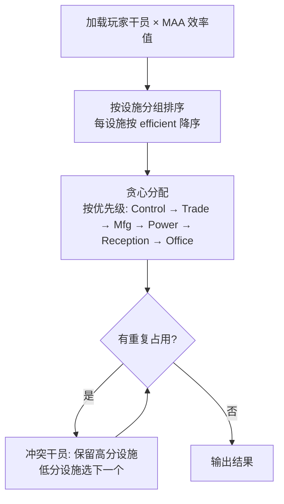

# 基建排班策略概要

## 核心原则

**排班 = 每设施选当前最优 N 人，不重复即可。** 联动/体系是锦上添花，可有可无。不同玩家 box 不同、换班频率不同——策略不应预设"全 box + 高频换班"。

## 数据链路

| 文件 | 来源 | 内容 |
|------|------|------|
| `building_data.json` | [ArknightsGameData](https://github.com/Kengxxiao/ArknightsGameData) | chars → buffId + phase; buffs → roomType + skillIcon |
| `infrast.json` | MAA 内置 | skillIcon → efficient 效率值 (373 模板) |
| `operators_data.json` | MAA OperBox 回调 | 玩家干员的练度 elite/level/potential |

## 设施容量

| 设施 | 房间数 | 每间 | 总工位 |
|------|--------|------|--------|
| Control | ×1 | 5 | 5 |
| Trade | ×2 | 3 | 6 |
| Mfg | ×4 | 3 | 12 |
| Power | ×3 | 1 | 3 |
| Reception | ×1 | 2 | 2 |
| Office | ×1 | 1 | 1 |
| Dormitory | ×4 | 5 | 20 |

## 约束

**硬约束:**
- H1 人数上限 / H2 一干员一工位 / H3 精英化阶段解锁 / H4 设施类型匹配 / H5 产物类型匹配

**软约束:**
- 效率最大化 / 心情平衡（多班次时避免同一设施干员同时耗尽）/ 宿舍提供足够恢复速率

## 策略

### 单班次（默认基线）



核心算法就是对每个设施追问：**"我手里还有谁能胜任？排前面的没被占吧？那就放进去。"**

### 多班次

同一组干员无法支撑高频换班（心情消耗 → 需要轮休）。处理方式：

- 用户指定 `一天 N 换` → 把总候选池按心情需求切分为 N 份
- 每份独立执行单班次贪心
- 若某设施候选不足 → 降级到 `autofill: true`（委托 MAA 自动补位）

### 联动（可选增强）

联动不是求解器的驱动因素，而是**后校验的加分项**：

| 场景 | 处理方式 |
|------|----------|
| 凑齐了知名组合（巫恋+龙舌兰+卡夫卡等） | 标记为"推荐在同设施"，贪心时可锁定这几个位置 |
| 缺成员 | 不含作，剩余位置正常贪心 |
| 玩家 box 太小 | 整个步骤跳过 |

> 这一步是**可省略的**。缺 box 或低频换班时跳过完全没有副作用。

## 换班频率与策略匹配

| 换班频率 | 需要的策略复杂度 | 原因 |
|----------|-----------------|------|
| 一天一换 | **单班次贪心** | 干员够用，无轮换压力 |
| 一天两换 | 单班次贪心 × 2 份 | 需要两套人马，每套独立求解 |
| 一天三换 | 单班次贪心 × 3 份 | 可能需要降级到 autofill |

> 一天一换时"人间烟火→孤光共照"的中枢大体系完全没意义——你不换班，根本不需要那点额外恢复速度。

## 效率计算

直接使用 MAA `infrast.json` 的 `efficient` 字段作为排序权重：

- `all=30` / `CombatRecord=30.1` → 排队顺序
- `.1` 后缀 = "单产品技能优先"（MAA 内部标记）
- 只做排序，不做精确效率计算——最终效率由 MAA 自行决定

## 输出

生成符合 [MAA 基建排班协议](https://docs.maa.plus/zh-cn/protocol/base-scheduling-schema.html) 的 `custom_infrast/*.json`：

```json
{
  "plans": [{
    "name": "单班次",
    "rooms": {
      "control": [{"operators": ["阿米娅", "夕", "令", "凯尔希", "玛恩纳"]}],
      "trading": [
        {"operators": ["巫恋", "龙舌兰", "卡夫卡"]},
        {"operators": ["但书", "黑键", "吉星"]}
      ],
      "manufacture": [
        {"operators": ["野鬃", "远牙", "灰毫"], "product": "Battle Record"},
        {"operators": ["Castle-3"], "autofill": true}
      ]
    }
  }]
}
```

通过 MAA `Infrast` 任务 (mode=10000, filename=) 执行。

## 参考

- 完整评估: `docs/scheduling-strategy.md`
- MAA API: https://docs.maa.plus/zh-cn/protocol/integration.html
- 排班协议: https://docs.maa.plus/zh-cn/protocol/base-scheduling-schema.html
