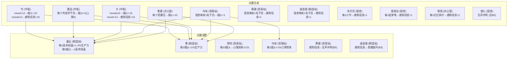

# 基建联动体系建模

> **版本**: 2026-05-26 · 基于 `buffs_infrastructure.json` (520 buff) + `character_identity.json` (415 干员) 交叉核验
>
> 每个体系一个独立函数。同层体系之间并行计算后线性叠加（游戏内效果本即加法，利用 `∫ Σ = Σ ∫` 分别积分后求和）。

---

## 总体架构

求解器分五阶段执行。体系函数分布在 Phase 1（预计算常数层）、Phase 2（制造站穷举中评估 A1-A6）、Phase 5（精确验证时注入 B 层）。

```
solve(全box干员池, layout)
  │
  ├─ Phase 1: 预计算（常数层，无需知道入选者）
  │     C1: compute_control_global_bonus(固定中枢方案) → GlobalBonus
  │     C2: global_burn = 常数（12h 不触发截断）
  │     B1: compute_buff_pool(固定中枢, 满宿舍估计) → BuffPool (保守值)
  │     B2: compute_engineering_robots(layout) → int
  │     B4: compute_monster_cuisine(宿舍配置) → int
  │     中枢方案固定为社区最优: 令+重岳+夕+凯尔希+焰尾
  │
  ├─ Phase 2: 制造站穷举（精确评估 A 层联动）
  │     按产物分离: CR 60人 / PG 56人
  │     剪枝规则 1-3 过滤 → ~1,500 种组合 per product
  │     每种组合:
  │         per_op = Σ op.to_segments(room_type, product)
  │         synergy = A1(synergy_pair) + A2(synergy_faction_room)
  │                 + A3(synergy_skill_count) + A4(synergy_skill_alias)
  │                 + A5(synergy_automation) + A6(synergy_facility_count)
  │         P(t) = 1 + 0.01*3 + (per_op + synergy) / 100
  │         output = base_rate × ∫₀¹² P(t) dt
  │     按产出降序排列
  │
  ├─ Phase 3: 制造站跨间贪心（无回溯）
  │     for each product_type:
  │         for combo in sorted_list:
  │             if 组合中干员均未被前序房间占用: 选中, 标记已用
  │             凑满 2 间后跳出
  │
  ├─ Phase 4: 剩余设施贪心
  │     Trade(6人) → Power(3人) → Reception(2人) → Office(1人)
  │     所有设施共享剩余池，支配偏序排序后贪心取值
  │     Control 复用 Phase 1 固定方案
  │
  └─ Phase 5: 精确验证（注入 B 层 + C 层精确值）
        B5-B7 用实际干员分配重新计算
        for each room:
            final_synergy = Phase2_synergy + B层注入(B3,B5,B6,B7) + C1_global_bonus
            P(t) = 1 + 0.01*n + (Σ per_op + final_synergy) / 100
            output = base_rate × ∫₀¹² P(t) dt + A7订单机制(贸易站)
        如有显著偏差 → 局部调整
```

---

## A 层 — 同房间体系

> **共同接口**: `synergy_efficiency(operators: list[Operator], room_type: str, product: str, context: GlobalContext) → list[LinearSegment]`
>
> 内部按注册表 dispatch 到各 A1-A7 子函数，各子函数并行计算后线性叠加。

---

### A1 干员配对

**机制**: 特定干员组合出现在同一房间时，触发固定效率加成。

**涉及的 buff**:

| buffId | 设施 | 持有者 | 条件 | 加成 |
|--------|------|--------|------|------|
| `manu_prod_spd_double[000]` | Mfg | 阿兰娜 | 温米同房 | 贵金属 +15% |
| `manu_prod_spd_double[100]` | Mfg | Miss.Christine | 酒神同房 | 作战记录 +30% |
| `trade_ord_spd&cost_P[000]` | Trade | 德克萨斯 | 拉普兰德同房 | 效率 +65%（心情消耗 +0.3） |
| `trade_ord_limit&cost_P[020]` | Trade | 贝洛内 | 伺夜同房 | 订单上限 +2 |
| `trade_ord_limit&cost_P[010]` | Trade | 德克萨斯 | 能天使同房 | 心情消耗 -0.3 |
| `trade_ord_limit&cost_P[000]` | Trade | 拉普兰德 | 德克萨斯同房 | 订单上限 +2 |
| `trade_ord_limit&cost_P[001]` | Trade | 拉普兰德 | 德克萨斯同房 | 订单上限 +4 |
| `trade_ord_spd&multiPar[100]` | Trade | 蕾缪安 | 能天使同房 | 效率额外 +25% |

> 注意：`manu_formula_spd&bd[001]`（情同手足，怒潮凛冬持有）基础效率 30%，条件触发额外 +10%（与乌萨斯学生自治团同房），属于 A1 的组合型配对。

**函数签名**:

```python
def synergy_pair(
    operators: list[Operator],
    room_type: str,
    product: str,
) -> list[LinearSegment]:
    """识别同房间干员配对组合，输出聚合常数段"""
```

**判定逻辑**:

1. 扫描房间干员列表，匹配配对表（硬编码或从 buff 元数据生成）
2. 条件满足 → 输出该对的 `LinearSegment(a=k, b=0, t_start=0, dt=T)`
3. 多个配对并行叠加

**边界情况**:
- 一个干员可能参与多个配对（如德克萨斯同时触发拉普兰德+能天使两条）
- 12h 单班次内心情消耗/恢复变化不影响 e(t)，但需记录 `mood_burn_modifier` 留作多班次扩展点

---

### A2 阵营/势力计数（同房间）

**机制**: 统计同房间内特定阵营干员数量，按人数提供效率加成。

**涉及的 buff**:

| buffId | 设施 | 持有者 | 计数对象 | 每人加成 |
|--------|------|--------|----------|----------|
| `trade_ord_spd_par[000]` | Trade | 摩根 | 格拉斯哥帮 | +20% 效率 |
| `trade_ord_spd_par[001]` | Trade | 新约能天使 | 拉特兰干员 | +15% 效率 |
| `manu_prod_spd&fraction[000]` | Mfg | 历阵锐枪芬 | A1小队干员 | +10% 生产力 |

> `trade_ord_spd_par[000]` 同时含 A1 配对（"当与推进之王同房额外+35%"），需在 A2 计数基础上叠加 A1。

**函数签名**:

```python
def synergy_faction_room(
    operators: list[Operator],
    room_type: str,
    product: str,
) -> list[LinearSegment]:
    """统计同房间阵营干员数，按每人加成输出常数段"""
```

**判定逻辑**:

1. 对房间内每个干员，检查其是否持有阵营计数型 buff
2. 若持有 → 统计房间内匹配阵营的干员数 → `加成 = 人数 × 每人加成`
3. 格拉斯哥帮和拉特兰的"同房计数"与"同房配对"两条独立处理，A1 单独输出额外配对加成

---

### A3 技能类型计数

**机制**: 统计同房间内特定类型的技能数量，为持有者提供效率加成。

**涉及的 buff**:

| buffId | 设施 | 持有者 | 计数对象 | 每个加成 |
|--------|------|--------|----------|----------|
| `manu_skill_spd1[000]` | Mfg | 水月 | 标准化类技能 | +5% |
| `manu_skill_spd1[010]` | Mfg | 多萝西 | 莱茵科技类技能 | +5% |
| `manu_skill_spd1[020]` | Mfg | 苍苔 | 金属工艺类技能 | +5% |

> `manu_skill_limit[000]`（勘探背包，溯光星源）计数莱茵科技→仓库容量+5，不影响 e(t)，不建模。

**函数签名**:

```python
def synergy_skill_count(
    operators: list[Operator],
    room_type: str,
) -> list[LinearSegment]:
    """统计同房间内技能类型数量，按技能数提供加成"""
```

**判定逻辑**:

1. 识别持有 A3 buff 的干员
2. 统计房间内匹配的技能类型数量
3. 加成 = 技能数 × 每人加成
4. 需先执行 A4（技能类型别名）将"也视作"的类别合并计数

---

### A4 技能类型别名

**机制**: 将特定类型的技能标记为另一类型，扩大 A3 的计数池。

**涉及的 buff**:

| buffId | 设施 | 持有者 | 效果 |
|--------|------|--------|------|
| `manu_skill_change[000]` | Mfg | 海沫 | 莱茵科技类、红松骑士团类 → 也视作标准化类 |

**函数签名**:

```python
def synergy_skill_alias(
    operators: list[Operator],
) -> dict[str, list[str]]:
    """返回技能类型别名映射: {源类型: [目标类型1, 目标类型2]}
    供 A3 在计数前展开"""
```

**判定逻辑**:

1. 检查房间内是否存在持有 `manu_skill_change` 的干员
2. 若存在 → 返回别名映射
3. A3 使用此映射将源类型的技能复制一份计为别名类型

---

### A5 自动化体系

**机制**: 持有者进驻制造站后，同房间其他干员的个人效率归零。持有者从发电站数量获得生产力。

**涉及的 buff**:

| buffId | 设施 | 持有者 | 其他干员 | 每个发电站 |
|--------|------|--------|----------|------------|
| `manu_prod_spd&power[000]` | Mfg | 森蚺/掠风/异客 | 效率归零 | +5% |
| `manu_prod_spd&power[010]` | Mfg | 温蒂/森蚺 | 效率归零 | +10% |
| `manu_prod_spd&power[020]` | Mfg | 温蒂 | 效率归零 | +15% |

**函数签名**:

```python
def synergy_automation(
    operators: list[Operator],
    room_type: str,
    power_count: int,  # 发电站总数，来自 layout
) -> tuple[list[LinearSegment], set[str]]:
    """若房间有自动化干员，返回 (自动化产出段, 需归零的干员名集合)"""
```

**判定逻辑**:

1. 扫描房间，检查是否有自动化干员
2. 若有 → 输出 `(加成段, 其他干员名集合)`
3. 求解器在积分前将 `归零集合` 中的干员 e(t) 强制设为 0
4. 自动化持有者自身的基础效率仍需参与计算（`1 + 0.01*n` 中的人头，但不包括归零干员）

**注意**: 自动化干员与其他自动化干员可共存（如森蚺+温蒂同时在场），各自独立计算发电站加成，但互不归零对方

---

### A6 设施数量联动

**机制**: 根据基建内其他设施的数量/等级为当前房间提供效率加成。

**涉及的 buff**:

| buffId | 设施 | 持有者 | 联动对象 | 加成公式 |
|--------|------|--------|----------|----------|
| `manu_prod_spd&trade[000]` | Mfg | 清流 | 每个贸易站 | 贵金属 +20%/间 |
| `manu_prod_spd&trade[1000]` | Mfg | 引星棘刺 | 每个贸易站 | 贵金属 +3%/间 |
| `manu_formula_spd&dorm&lv[000]` | Mfg | 娜仁图亚 | 每间宿舍每级 | 贵金属 +1% |
| `trade_ord_spd&dorm&lv[000]` | Trade | 空弦 | 每间宿舍每级 | +1% 效率 |
| `trade_ord_spd&dorm&lv[010]` | Trade | 空弦 | 每间宿舍每级 | +2% 效率 |
| `trade_ord_spd&meet[000]` | Trade | 伺夜 | 会客室每级 | +5%（上限 40%） |
| `trade_ord_spd&meet[010]` | Trade | 渡桥 | 会客室每级 | +5%（上限 30%） |
| `trade_ord_spd&formula[000]` | Trade | 石英 | 制造站配方种类 | 每类 +2% |
| `trade_ord_limit&trade&lv[000]` | Trade | 佩佩 | 贸易站每级 | 订单上限 +1 |
| `trade_ord_limit&trade&lv[001]` | Trade | 瑰盐 | 贸易站每级 | 订单上限 +1 |

**函数签名**:

```python
def synergy_facility_count(
    operators: list[Operator],
    room_type: str,
    product: str,
    layout: LayoutConfig,  # 提供设施数量/等级信息
) -> list[LinearSegment]:
    """根据设施数量/等级计算联动加成"""
```

**判定逻辑**:

1. 扫描当前房间干员，识别持有 A6 类 buff 的干员
2. 查询对应设施数量/等级 → 计算加成
3. 有上限的按上限 clamp

---

### A7 订单机制

**机制**: 贸易站专有。涉及订单上限、订单数量、赤金生产线等概念的相互转换。品质/违约/独占部分用期望值近似。

> **MVP 近似策略**（用户确认：用期望值近似）:
> - 高品质订单概率 ≈ 10%（α 版 5%，β 版 10%），每次高品质订单 LMD 收益 +500
> - 违约订单（但书体系）：假定每笔订单 70% 概率被判定为违约（因但书提升交付数+2，实际交付 = 2+2=4 < 4 触发违约边界极窄，取 100%），赤金消耗按违约后交付数计算
> - 独占订单（佩佩/可露希尔）：视为常态订单参与平均，不受效率影响但受无人机加速

**涉及的 buff（全量列出）**:

| 类别 | buffId | 持有者 | 机制 |
|------|--------|--------|------|
| 独占 | `trade_ord_pepe[000]` | 佩佩 | 固定获取特别独占订单 |
| 独占 | `trade_ord_closure[000]` | 可露希尔 | 固定可露希尔特别订单 |
| 上限→效率 | `trade_ord_spd_variable[000]` | 琳琅诗怀雅 | 每个订单上限 +4% 效率 |
| 上限→效率 | `trade_ord_spd_variable3[000]` | 锏 | 每 5 个订单上限 +25% 效率（上限 100%） |
| 效率→效率 | `trade_ord_spd_variable2[000]` | 雪雉 α | 每 5% 效率额外 +5%（上限 25%） |
| 效率→效率 | `trade_ord_spd_variable2[001]` | 雪雉 β | 每 5% 效率额外 +5%（上限 35%） |
| 效率→上限 | `trade_ord_limit_count[000]` | 孑 | 每 10% 效率 -1 上限（最少 1），每 1 笔订单 +4% 效率 |
| 差额→效率 | `trade_ord_limit_diff[000]` | 孑 | 订单数与上限每差 1 笔 +4% 效率 |
| 人数→效率 | `trade_ord_spd&share[000]` | 火哨 | 除自身外每名工作干员 +15% |
| 人数→效率 | `trade_ord_spd&share[001]` | 吉星 α | 除自身外每名工作干员 +10% |
| 人数→效率 | `trade_ord_spd&share[002]` | 吉星 β | 除自身外每名工作干员 +20% |
| 违约 | `trade_ord_law[000]` | 但书 | 交付数 <4 → 违约（期望 100%） |
| 违约 | `trade_ord_against[000]` | 但书 α | 违约时赤金交付 +1 |
| 违约 | `trade_ord_against[010]` | 但书 β | 违约时赤金交付 +2 |
| 赤金线→效率 | `trade_ord_spd&gold[000]` | 图耶 α | 每 4 条赤金线 +15% |
| 赤金线→效率 | `trade_ord_spd&gold[010]` | 图耶 β | 每 2 条赤金线 +15% |
| 赤金线→效率 | `trade_ord_spd&gold[100]` | 鸿雪 | 每 1 条赤金线 +5% |
| 赤金线→赤金线 | `trade_ord_line_gold[000]` | 绮良 α | 每 4 条赤金线 +2 条赤金线 |
| 赤金线→赤金线 | `trade_ord_line_gold[010]` | 绮良 β | 每 2 条赤金线 +2 条赤金线 |
| 杜林→赤金线 | `trade_ord_line_durin[010]` | 鸿雪 | 每 1 名杜林族 +1 条赤金线（上限 4） |
| 效率+上限 | `trade_ord_spd&limit[000]` | 翎羽/四月/黑角 | +10% + 上限+2 |
| 效率+上限 | `trade_ord_spd&limit[001]` | 涤火杰西卡/四月 | +10% + 上限+4 |
| 效率+上限 | `trade_ord_spd&limit[010]` | 远山/玫兰莎/梓兰 | +25% + 上限+1 |
| 效率+上限 | `trade_ord_spd&limit[020]` | 银灰/讯使/角峰 | +15% + 上限+2 |
| 效率+上限 | `trade_ord_spd&limit[021]` | 崖心 | +15% + 上限+4 |
| 效率+上限 | `trade_ord_spd&limit[022]` | 银灰 | +20% + 上限+4 |
| 效率+上限 | `trade_ord_spd&limit[031]` | 可颂 | +30% + 上限+1 |
| 效率+上限 | `trade_ord_spd&limit[033]` | 拜松 | +30% + 上限+1 |
| 效率+上限 | `trade_ord_spd&limit[035]` | 衡沙 | +30% + 上限+1 |
| 效率+上限 | `trade_ord_spd&limit[036]` | 齐尔查克 | +30% + 上限+1 |
| 效率-上限 | `trade_ord_spd&limit[100]` | 锏 | +20% + 上限-2 |
| 效率-上限 | `trade_ord_spd&limit[101]` | 锏 | +25% + 上限-6 |
| 必定2交付 | `trade_ord_spd&wt[000]` | U-Official | 赤金交付数必定为 2 |
| 木天蓼→效率 | `trade_ord_spd&limit&bd[000]` | 泰拉大陆调查团 | 每 1 个木天蓼 +3% |

**函数签名**:

```python
def synergy_order_mechanics(
    operators: list[Operator],
    room_type: str,
    global_context: GlobalContext,  # 提供赤金生产线总数、全局干员计数等
) -> OrderMechanicsResult:
    """计算贸易站订单机制的所有联动效果

    Returns:
        OrderMechanicsResult:
            efficiency_segments: list[LinearSegment]  # 额外效率段
            order_limit_modifier: int                  # 订单上限修改量
            gold_line_modifier: int                    # 赤金生产线修改量
            expected_gold_per_order: float             # 期望每单赤金消耗
            expected_lmd_per_order: float              # 期望每单 LMD 收益
    """
```

> A7 是 MVP 中最复杂的体系，详见 [§A7 详细建模](#a7-详细建模)。

---

## B 层 — 跨设施体系

> 这些体系需要全局 context：中枢配置、宿舍配置、全基建干员分布。

---

### B1 人间烟火 / 感知信息 / 巫术结晶

**机制**: 中枢和宿舍生成 buff 点数 → 工作设施消费点数转化为效率。这是游戏中最复杂的跨设施级联。

**数据流**:



**涉及的 buff**: 共 20 条，散落在 CONTROL / DORMITORY / MANUFACTURE / TRADING / HIRE / MEETING 六个设施类型中。

**函数签名**:

```python
@dataclass
class BuffPool:
    yanhuo: int = 0        # 人间烟火
    perception: int = 0    # 感知信息
    wushu_crystal: int = 0 # 巫术结晶

def compute_buff_pool(
    control_operators: list[Operator],
    dormitory_operators: list[Operator],  # 所有宿舍干员
    global_assignments: dict[str, list[Operator]],  # 设施→干员列表
    layout: LayoutConfig,
) -> BuffPool:
    """计算全局 buff 点数池

    1. 扫描所有生成者 → 累加烟火/感知信息
    2. 应用转化规则 (烟火→巫术, 感知信息→思维链环(B3)/无声共鸣(B5))
    3. 返回 BuffPool 供各房间消费
    """
```

**对 A 层注入**: BuffPool 在 Phase 1 用固定中枢方案 + 满宿舍估计计算为保守常数。Phase 5 精确验证时用实际干员分配重新计算。

**MVP 处理策略**: 中枢方案固定为社区最优（令+重岳+夕+凯尔希+焰尾）。Phase 1 用此固定方案 + 满 20 人宿舍估计预计算 BuffPool，Phase 5 验证时再修正。此策略避免了循环依赖——制造站穷举和剩余设施贪心阶段 BuffPool 不变。

---

### B2 工程机器人

**机制**: 中枢干员（至简的"绘图设计"）根据全基建设施等级生成工程机器人，制造站干员消费机器人获得生产力。

**涉及的 buff**:

| buffId | 设施 | 持有者 | 机制 |
|--------|------|--------|------|
| `manu_constrLv[000]` | Mfg | 至简 | 每间设施每级 +1 机器人（上限 64） |
| `manu_prod_spd_bd[100]` | Mfg | 至简 α | 每 16 个机器人 +5% 生产力 |
| `manu_prod_spd_bd[110]` | Mfg | 至简 β | 每 8 个机器人 +5% 生产力 |

**函数签名**:

```python
def compute_engineering_robots(layout: LayoutConfig) -> int:
    """计算工程机器人总数 = Σ(每间设施 × 等级)
    243 布局 3 级设施 ≈ 14 间 × 3 级 = 42 机器人"""
```

---

### B3 思维链环

**机制**: 迷迭香将感知信息（来自 B1）转化为思维链环，再转化为制造站生产力。这是 B1 的子链路。

**涉及的 buff**:

| buffId | 设施 | 持有者 | 机制 |
|--------|------|--------|------|
| `manu_prod_spd_bd_n1[000]` | Mfg | 迷迭香 | 感知信息 → 思维链环（1:1） |
| `manu_prod_spd_bd[000]` | Mfg | 迷迭香 α | 每 2 链环 +1% 生产力 |
| `manu_prod_spd_bd[010]` | Mfg | 迷迭香 β | 每 1 链环 +1% 生产力 |

**函数签名**:

```python
def compute_thought_chains(perception: int) -> int:
    """感知信息 → 思维链环 (1:1 转化)"""
```

**边界**: 迷迭香本人在 B1 中作为感知信息生成者（宿舍每有 1 人 +1），在 B3 中作为消费者。同一人同时是生成者和消费者 → 无循环依赖（生成量只依赖宿舍人数，不依赖自身属性）。

---

### B4 魔物料理

**机制**: 森西（宿舍）生成魔物料理，玛露西尔（制造站）和齐尔查克（贸易站）消费。

**涉及的 buff**:

| buffId | 设施 | 持有者 | 机制 |
|--------|------|--------|------|
| `dorm_rec_bd_dungeon[000]` | Dorm | 森西 | 当前宿舍每级提供 1 层魔物料理 |
| `manu_prod_spd_bd[400]` | Mfg | 玛露西尔 | 每 1 点魔物料理 +1% 生产力 |
| `trade_ord_spd_bd[100]` | Trade | 齐尔查克 | 每 1 点魔物料理 +1% 订单效率 |
| `meet_spd_bd[001]` | Meeting | 莱欧斯 | 每 1 点魔物料理 +2% 线索搜集速度（会客室，不参与产能） |

**函数签名**:

```python
def compute_monster_cuisine(dormitory_operators: list[Operator]) -> int:
    """森西所在宿舍等级 → 魔物料理数量"""
```

---

### B5 无声共鸣

**机制**: 塑心（宿舍）生成无声共鸣，黑键（贸易站）消费。与 B1 感知信息联动。

**涉及的 buff**:

| buffId | 设施 | 持有者 | 机制 |
|--------|------|--------|------|
| `dorm_bd_num[000]` | Dorm | 塑心 | 该宿舍每有 1 名干员 +1 无声共鸣 |
| `dorm_rec_all&bd[000]` | Dorm | 塑心 | 每 5 点无声共鸣额外 +0.01 心情恢复 |
| `trade_ord_spd_bd_n1[000]` | Trade | 黑键 | 感知信息 → 无声共鸣（1:1） |
| `trade_ord_spd_bd[000]` | Trade | 黑键 α | 每 4 点无声共鸣 +1% 订单效率 |
| `trade_ord_spd_bd[010]` | Trade | 黑键 β | 每 2 点无声共鸣 +1% 订单效率 |
| `hire_spd_bd_n1_n1[300]` | Hire | 深律 | 每个招募位 +15 无声共鸣 |

**函数签名**:

```python
def compute_silent_resonance(
    dormitory_operators: list[Operator],
    hire_operators: list[Operator],
    perception: int,  # 来自 B1
) -> int:
    """计算无声共鸣总数 = 塑心生成 + 感知信息转化 + 深律生成"""
```

---

### B6 全局阵营计数

**机制**: 统计全基建范围内特定阵营的干员数量（不限房间），为持有者提供效率加成。

**涉及的 buff**:

| buffId | 设施 | 持有者 | 计数对象 | 每人加成 |
|--------|------|--------|----------|----------|
| `power_rec_rhine[000]` | Power | 缪尔赛思 | 莱茵生命（除自身，上限 5） | +3% 充能速度 |
| `manu_formula_spd&cost_bd[000]` | Mfg | 杏仁 | 黑钢国际（上限 3） | 贵金属 +2% |
| `manu_formula_spd&cost_bd[100]` | Mfg | 娜斯提 | 莱茵生命（上限 5） | 贵金属 +3% |
| `trade_ord_spd&tag[010]` | Trade | 真言 | 有精英干员的设施（上限 10） | +2% 效率 |
| `trade_ord_spd&tag[020]` | Trade | 风絮 | 有岁干员的设施（上限 5） | +4% 效率 |

**函数签名**:

```python
def compute_global_faction_counts(
    all_assignments: dict[str, list[Operator]],  # 设施→干员列表
) -> FactionCounts:
    """统计全基建各阵营/标签干员数量(去重)和各设施进驻情况

    Returns:
        FactionCounts:
            faction_counts: dict[str, int]   # 阵营→干员数
            facility_tags: dict[str, set]    # 设施→进驻的标签集合
    """
```

---

### B7 跨房间配对

**机制**: 干员 A 在某设施时，触发位于另一设施的干员 B 的额外效果。

**涉及的 buff**:

| buffId | A 所在设施 | B 所在设施 | B 的持有者 | 条件 | 加成 |
|--------|-----------|-----------|------------|------|------|
| `power_rec_spd_P[000]` | Control | Power | Friston-3 | 凯尔希在 Control | 无人机充能 +5% |
| `power_rec_spd_P[001]` | Train | Power | PhonoR-0 | 逻各斯在训练室 | 无人机充能 +5% |
| `trade_ord_spd_ext[000]` | 任意 | Trade | 深巡 α | 乌尔比安在基建内 | 效率 +5% |
| `trade_ord_spd_ext[001]` | 任意 | Trade | 深巡 β | 乌尔比安在基建内 | 效率 +10% |
| `trade_ord_spd_ext[020]` | 任意 | Trade | 贝洛内 α | 伺夜在基建内 | 效率 +5% |
| `trade_ord_spd_ext[021]` | 任意 | Trade | 贝洛内 β | 伺夜在基建内 | 效率 +10% |
| `hire_spd_cost&char[001]` | Control | Hire | 圣聆初雪 | 凛御银灰在 Control | 联络速度 +10% |
| `meet_spd_ext&P[000]` | Dorm | Meeting | 信仰搅拌机 | 菲亚梅塔在宿舍 | 线索速度 +10% |
| `control_token_prod_spd[000]` | Power | Control | 布丁 | ≥2 作业平台在发电站 | 制造站 +2% |
| `control_pow_bot[000]` | Power | Control | 森蚺 | Lancet-2 在发电站 | 发电站额外 +2 |

**函数签名**:

```python
def compute_cross_room_pairs(
    all_assignments: dict[str, list[Operator]],
) -> dict[str, CrossRoomBonus]:  # 设施→干员名→额外加成
    """计算所有跨房间配对的触发情况"""
```

---

## C 层 — 中枢全局

### C1 中枢全局效率加成

**机制**: 中枢干员为全基建制造站/贸易站提供固定效率加成（同种效果取最高）。

**涉及的 buff**:

| buffId | 持有者 | 效果 | 条件 |
|--------|--------|------|------|
| `control_prod_spd[000]` | 凯尔希 | 制造站 +2% | 无条件 |
| `control_prod_spd[1000]` | Mon3tr | 制造站 +2% | 无条件 |
| `control_token_prod_spd[000]` | 布丁 | 制造站 +2% | ≥2 作业平台在发电站 |
| `control_token_prod_spd2[000]` | 麒麟R夜刀 | 制造站 +2% | 怪物猎人小队也进驻中枢 |
| `control_token_prod_spd3[000]` | 斩业星熊 | 制造站 +3% | 龙门近卫局也进驻中枢 |
| `control_prod_tra_spd[000]` | 望 | 贸易站 +7% 或 制造站 +2% | 外势 vs 实地 |

**函数签名**:

```python
@dataclass
class GlobalBonus:
    mfg_bonus: float = 0.0   # 制造站全局效率加成（百分值）
    trade_bonus: float = 0.0 # 贸易站全局效率加成（百分值）

def compute_control_global_bonus(
    control_operators: list[Operator],
    layout: LayoutConfig,
) -> GlobalBonus:
    """计算中枢全局效率加成（同种取最高）"""
```

### C2 中枢全局心情恢复

**机制**: 中枢干员影响全局 `mood_burn` 参数，传递给所有工作房间的 `e(t)` 构造。

**涉及的 buff**: 38 条 CONTROL buff，核心效果为：

- 中枢内干员心情恢复 (`control_mp_cost[xxx]`): 每人 +0.05/h
- 工作设施干员心情恢复 (`control_mp_bd_cost_expand[000]` 孤光共照): +0.05/h，每 20 烟火额外 +0.05
- 工作设施干员心情恢复 (`control_mp_expand_double[000]` 巴别塔之帜): +0.1/h
- 深海猎人体系 (`control_mp_aegir1/aegir2`): 特殊叠加
- 宿舍全体恢复 (`control_dorm_rec[xxx]`): 影响宿舍但不影响工作干员 burn

**函数签名**:

```python
def compute_global_burn(
    control_operators: list[Operator],
    buff_pool: BuffPool,  # 来自 B1
) -> float:
    """计算全局 mood_burn 参数 (工作干员心情消耗率净值)

    基础 burn = 0.75/h (3人工位)
    中枢减免 = Σ 中枢恢复效果
    孤光共照/巴别塔之帜 = 工作干员直接心情恢复
    burn = max(0, 基础 - 减免)

    MVP 单班次 12h: burn 为常数，固定中枢方案下预计算一次即可。
    """
```

---

## D 层 — 非生产设施

### D1 会客室（Reception / MEETING）

**涉及 buff**: 67 条（含 25 条条件型 + 42 条效率型）

会客室线索搜集不影响产能。MVP 策略：按线索搜集效率贪心选人，不建联动模型。

**简化处理**: 会客室 2 工位直接取最高效率的 2 人，不考虑线索倾向/联动。

### D2 人力办公室（Office / HIRE）

**涉及 buff**: 43 条

人脉联络速度不影响产能。MVP 策略：按联络速度贪心选 1 人。

---

## 体系函数总清单

| 编号 | 体系 | 函数 | 所在层 | 依赖 |
|------|------|------|:---:|------|
| A1 | 干员配对 | `synergy_pair()` | A | 房间干员列表 |
| A2 | 阵营计数(同房) | `synergy_faction_room()` | A | 房间干员列表 |
| A3 | 技能类型计数 | `synergy_skill_count()` | A | 房间干员列表 + A4 |
| A4 | 技能类型别名 | `synergy_skill_alias()` | A | 房间干员列表 |
| A5 | 自动化 | `synergy_automation()` | A | 房间干员 + layout |
| A6 | 设施数量联动 | `synergy_facility_count()` | A | 房间干员 + layout |
| A7 | 订单机制 | `synergy_order_mechanics()` | A | 房间干员 + GlobalContext |
| B1 | 人间烟火/感知信息 | `compute_buff_pool()` | B | 中枢+宿舍+全基建 |
| B2 | 工程机器人 | `compute_engineering_robots()` | B | layout |
| B3 | 思维链环 | `compute_thought_chains()` | B | B1(感知信息) |
| B4 | 魔物料理 | `compute_monster_cuisine()` | B | 宿舍干员 |
| B5 | 无声共鸣 | `compute_silent_resonance()` | B | 宿舍+B1(感知信息) |
| B6 | 全局阵营计数 | `compute_global_faction_counts()` | B | 全基建干员 |
| B7 | 跨房间配对 | `compute_cross_room_pairs()` | B | 全基建干员 |
| C1 | 中枢全局效率 | `compute_control_global_bonus()` | C | 中枢干员 + layout |
| C2 | 中枢全局恢复 | `compute_global_burn()` | C | 中枢干员 + B1 |

**总计**: 16 个独立函数，覆盖 520 条基建 buff 中所有条件型/联动型 buff。

---

## A7 详细建模

A7（订单机制）是 MVP 中唯一需要概率近似的体系。以下是期望值建模方案。

### 订单基础参数（龙门商法，Lv3）

- 订单概率: 2 赤金/1000 LMD → 30%, 3 赤金/1500 LMD → 50%, 4 赤金/2000 LMD → 20%
- 期望赤金消耗: `2×0.3 + 3×0.5 + 4×0.2 = 2.9 赤金/单`
- 期望 LMD 收益: `1000×0.3 + 1500×0.5 + 2000×0.2 = 1450 LMD/单`
- 期望耗时: `(144×0.3 + 210×0.5 + 276×0.2) / 60 = 3.39 h/单`

### 但书违约体系

但书 (`trade_ord_law[000]`): 交付数 < 4 → 违约。配备 `trade_ord_against[010]` (β) 时交付数 +2。

- **默认交付期望 2.9 赤金 → < 4，100% 违约**
- 违约后交付数 = 2.9 + 2 = 4.9 赤金/单
- LMD 收益保持期望 1450（违约不影响 LMD）
- 实际效率 = `订单频率 × (1 + 效率加成)`，效率加成只影响频率不影响交付数

### 高品质订单期望

- α 版 (裁缝/手工艺品): 高品质概率 +5%，每次 +500 LMD → 期望 LMD = 1450 + 0.05×500 = 1475
- β 版: 高品质概率 +10% → 期望 LMD = 1450 + 0.10×500 = 1500
- 不影响赤金消耗

### 订单上限→效率（琳琅诗怀雅 + 锏）

- 每个订单上限 +4%（诗怀雅），无上限
- 每 5 个订单上限 +25%（锏），上限 100%（即 20 个订单上限后饱和）
- 订单上限 = 基础 10 + Σ 各干员修改量（含 A7 中的 ±上限 buff）

### 孑的复杂机制

`trade_ord_limit_count[000]`（市井之道）:
1. 其他干员提供的每 10% 效率 → 订单上限 -1（最少 1）
2. 每有 1 笔订单 → +4% 效率

`trade_ord_limit_diff[000]`（摊贩经济）:
- 订单数与上限每差 1 笔 → +4% 效率

这两个效果存在交互循环（效率→上限→效率），需要不动点迭代求解。

### 赤金生产线

- 基础: 每个制造站赤金房提供 1 条赤金生产线（243 默认 2 条）
- 绮良/鸿雪/杜林族 buff 可额外增加生产线
- 图耶/鸿雪/销路宣发将生产线数转化为效率

**函数实现策略**:

```python
def synergy_order_mechanics(
    operators: list[Operator],
    room_type: str,
    global_context: GlobalContext,
) -> OrderMechanicsResult:
    # 1. 基础效率计算（各干员直接效率 + A1-A6 联动）
    base_eff = sum_independent_efficiency(operators)

    # 2. 订单上限计算（含各干员 ±上限 buff）
    order_limit = 10 + sum_limit_modifiers(operators)

    # 3. 孑体系不动点迭代（效率↔上限↔效率）
    #    初始效率 = base_eff
    #    循环: 上限' = f(效率), 效率' = g(上限+订单数), 直到收敛
    eff, limit = _jordan_fixed_point(base_eff, order_limit)

    # 4. 赤金生产线→效率
    gold_lines = global_context.total_gold_lines
    # 图耶/鸿雪/销路宣发处理

    # 5. 违约/品质期望值调整
    expected_gold = 2.9  # 基础期望
    expected_lmd = 1450
    if has_butter(operators):  # 但书
        expected_gold = 4.9    # 100% 违约 +2
    if has_quality(operators):
        expected_lmd += quality_bonus(operators)

    return OrderMechanicsResult(...)
```

---

## 参考

- 策略概要: [`strategy-brief.md`](./strategy-brief.md)
- 效率函数建模: [`efficiency-function-design.md`](./efficiency-function-design.md)
- 约束体系基线: [`constraints-and-data-baseline.md`](./constraints-and-data-baseline.md)
